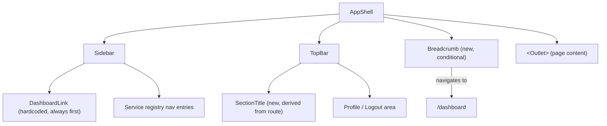
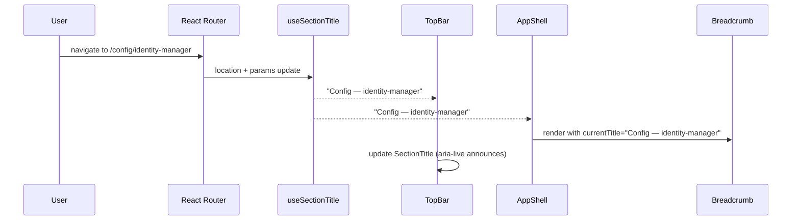

# Design Document

## Overview

This feature adds persistent back-navigation affordances to the admin panel shell so that
authenticated admins can always return to `/dashboard` from any route. Three coordinated
changes are made entirely at the shell level — no individual view components are modified:

1. A hardcoded **Dashboard Link** is pinned as the first item in the `Sidebar`.
2. A **Section Title** derived from the current route is displayed in the `TopBar`.
3. A **Breadcrumb** is rendered in the `AppShell` content area for dynamic routes
   (`/config/:serviceName`, `/app/:serviceName/*`).

All navigation state is derived from React Router's `useLocation` and `useParams` hooks,
so browser back/forward navigation also triggers correct updates.

---

## Architecture

### Component Interaction Diagram



### Route → Section Title Mapping

| Route pattern | Section Title |
|---------------|---------------|
| `/dashboard` | "Dashboard" |
| `/users` | "Users" |
| `/audit` | "Audit Log" |
| `/config/:serviceName` | `"Config — " + serviceName` |
| `/app/:serviceName/*` | `manifest.navigation[0].label` or `serviceName` |
| (no match) | `""` |

### Breadcrumb Visibility

| Route | Breadcrumb shown? |
|-------|-------------------|
| `/dashboard` | No |
| `/users` | No |
| `/audit` | No |
| `/config/:serviceName` | Yes |
| `/app/:serviceName/*` | Yes |

---

## Frontend Design

### 1. `useSectionTitle` Hook — New

A single hook encapsulates all route-to-title logic. It is consumed by both `TopBar`
(for the `SectionTitle`) and `AppShell` (for the `Breadcrumb` terminal segment).

```tsx
// admin-shell/src/presentation/hooks/useSectionTitle.ts
import { useLocation, useParams } from "react-router-dom";
import { useStore } from "@nanostores/react";
import { $serviceRegistry } from "../../stores/serviceRegistryStore";

export function useSectionTitle(): string {
  const location = useLocation();
  const params = useParams<{ serviceName?: string }>();
  const registry = useStore($serviceRegistry);

  const { pathname } = location;

  if (pathname === "/dashboard") return "Dashboard";
  if (pathname === "/users") return "Users";
  if (pathname === "/audit") return "Audit Log";

  if (params.serviceName) {
    if (pathname.startsWith("/config/")) {
      return `Config — ${params.serviceName}`;
    }
    if (pathname.startsWith("/app/")) {
      const entry = registry.find((s) => s.name === params.serviceName);
      return entry?.manifest?.navigation?.[0]?.label ?? params.serviceName;
    }
  }

  return "";
}
```

### 2. `TopBar.tsx` — Section Title Slot

The `TopBar` gains a left-aligned `SectionTitle` element. The existing profile/logout
area stays on the right. The title is wrapped in `aria-live="polite"` so screen readers
announce route changes.

```tsx
// admin-shell/src/presentation/components/layout/TopBar.tsx (additions)
import { useSectionTitle } from "../../hooks/useSectionTitle";

// Inside TopBar render:
const sectionTitle = useSectionTitle();

return (
  <header className="flex items-center justify-between gap-3 px-6 h-14 border-b border-white/10 bg-primary text-white shrink-0">
    <span aria-live="polite" className="text-sm font-medium text-gray-200">
      {sectionTitle}
    </span>
    {/* existing profile trigger / dropdown area */}
  </header>
);
```

### 3. `Sidebar.tsx` — Dashboard Link

The Dashboard Link is rendered before the service-registry loop. It uses the same
`NavLink` pattern as existing entries so the active style is applied automatically.

```tsx
// admin-shell/src/presentation/components/layout/Sidebar.tsx (additions)
import { NavLink } from "react-router-dom";

// Before the registry-derived nav groups:
<NavLink
  to="/dashboard"
  aria-current={location.pathname === "/dashboard" ? "page" : undefined}
  className={({ isActive }) =>
    `flex items-center gap-3 px-4 py-2 text-sm rounded-md transition-colors ${
      isActive
        ? "text-brand border-l-2 border-brand font-medium"
        : "text-gray-300 hover:text-white hover:bg-white/5"
    }`
  }
>
  🏠 Dashboard
</NavLink>
```

### 4. `Breadcrumb.tsx` — New Component

Rendered by `AppShell` only for dynamic routes. Uses `<Link>` for the "Dashboard"
segment so navigation is client-side.

```tsx
// admin-shell/src/presentation/components/layout/Breadcrumb.tsx
import { Link } from "react-router-dom";

interface BreadcrumbProps {
  currentTitle: string;
}

export function Breadcrumb({ currentTitle }: BreadcrumbProps) {
  return (
    <nav aria-label="Breadcrumb" className="flex items-center gap-2 px-6 py-3 text-sm text-gray-400 border-b border-white/5">
      <Link to="/dashboard" className="hover:text-white transition-colors">
        Dashboard
      </Link>
      <span aria-hidden="true">/</span>
      <span aria-current="page" className="text-white">
        {currentTitle}
      </span>
    </nav>
  );
}
```

### 5. `AppShell.tsx` — Breadcrumb Integration

`AppShell` uses `useLocation` to decide whether to render the `Breadcrumb`, and passes
the `sectionTitle` from `useSectionTitle` as the terminal segment.

```tsx
// admin-shell/src/presentation/components/layout/AppShell.tsx (additions)
import { useLocation } from "react-router-dom";
import { Breadcrumb } from "./Breadcrumb";
import { useSectionTitle } from "../../hooks/useSectionTitle";

const location = useLocation();
const sectionTitle = useSectionTitle();

const showBreadcrumb =
  location.pathname.startsWith("/config/") ||
  location.pathname.startsWith("/app/");

// In the content area, before <Outlet>:
{showBreadcrumb && <Breadcrumb currentTitle={sectionTitle} />}
<Outlet />
```

---

## Data Flow



---

## Correctness Properties

**P1 — Dashboard link always present**: For any authenticated route, the Sidebar SHALL
render a link to `/dashboard` as the first navigation item, regardless of the service
registry state.

**P2 — Section title accuracy**: For every route pattern defined in the mapping table,
`useSectionTitle` SHALL return the exact string specified. For unmatched routes it SHALL
return `""`.

**P3 — Breadcrumb visibility gate**: `showBreadcrumb` SHALL be `true` if and only if
`pathname.startsWith("/config/")` or `pathname.startsWith("/app/")`. It SHALL be `false`
for `/dashboard`, `/users`, `/audit`, and any unmatched route.

**P4 — No prop drilling**: The `SectionTitle` and `Breadcrumb` SHALL derive their content
exclusively from React Router hooks (`useLocation`, `useParams`) and the service registry
store — never from props passed down from parent components.

**P5 — aria-current correctness**: The Dashboard Link SHALL carry `aria-current="page"`
if and only if `pathname === "/dashboard"`. The Breadcrumb terminal segment SHALL always
carry `aria-current="page"`.

---

## File Changeset

### New files

| File | Purpose |
|------|---------|
| `admin-shell/src/presentation/hooks/useSectionTitle.ts` | Route → title mapping hook |
| `admin-shell/src/presentation/components/layout/Breadcrumb.tsx` | Breadcrumb component |
| `admin-shell/src/presentation/hooks/useSectionTitle.test.ts` | Hook unit tests |
| `admin-shell/src/presentation/components/layout/Breadcrumb.test.tsx` | Component unit tests |

### Modified files

| File | Change |
|------|--------|
| `admin-shell/src/presentation/components/layout/TopBar.tsx` | Add SectionTitle slot using `useSectionTitle` |
| `admin-shell/src/presentation/components/layout/Sidebar.tsx` | Add hardcoded Dashboard Link as first item |
| `admin-shell/src/presentation/components/layout/AppShell.tsx` | Conditionally render `Breadcrumb` before `<Outlet>` |
