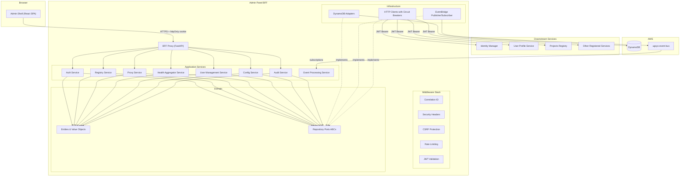
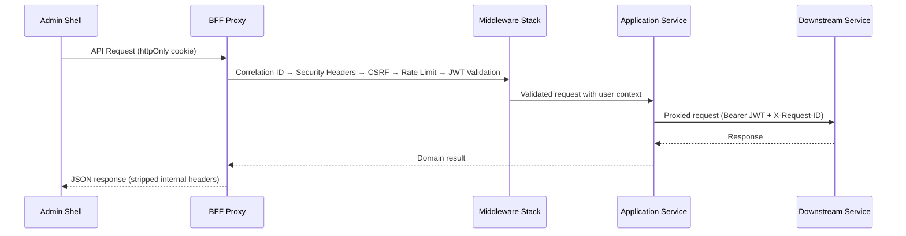

# Design Document — Admin Panel

## Overview

The Admin Panel is a two-component system: a React Single-Page Application (Admin Shell) and a Python/FastAPI Backend-for-Frontend (BFF Proxy). The Admin Shell provides a plugin-based layout where micro-frontends contributed by registered microservices are dynamically loaded and mounted. The BFF Proxy sits between the Admin Shell and all downstream ugsys services, handling authentication relay, RBAC enforcement, service discovery, request proxying, health aggregation, audit logging, and event integration.

The BFF Proxy follows the same hexagonal architecture as all other ugsys services (presentation → application → domain ← infrastructure), uses DynamoDB for persistence (service registry, audit logs), EventBridge for async events, and communicates with the Identity Manager and User Profile Service via REST with circuit breakers.

The Admin Shell is served from `https://admin.apps.cloud.org.bo` and all BFF API routes are versioned under `/api/v1/`.

### Key Design Decisions

| Decision | Rationale |
|----------|-----------|
| BFF Proxy as a separate FastAPI service | Keeps auth token handling server-side (httpOnly cookies), enables RBAC enforcement at the API layer, and follows the platform's hexagonal architecture |
| Plugin Manifest with JSON Schema validation | Provides a strict contract for micro-frontend registration, enabling runtime validation and safe composition |
| DynamoDB for Service Registry and Audit Logs | Consistent with platform data store strategy; each service owns its tables |
| Circuit breaker for Identity Manager and User Profile Service calls | Prevents cascade failures when downstream services are unavailable (Req 9.7) |
| Built-in views for Health Dashboard, User Management, and Audit Logs | These are core admin functions that don't need micro-frontend isolation |
| EventBridge for async event processing | Consistent with platform event-driven architecture; enables real-time dashboard updates |
| Double Submit Cookie for CSRF | Platform standard for browser-facing services with httpOnly JWT cookies |
| Hybrid service registration | Static seed file for known platform services (loaded at BFF startup) + runtime registration API for future/third-party services. Known services don't need to self-register on every deploy |
| Frontend hexagonal architecture | Domain/infrastructure/presentation layers on the frontend, mirroring the BFF pattern. Repository interfaces in domain, concrete implementations in infrastructure |
| Nanostores for state management | Framework-agnostic atoms that work with React and avoid Context hydration issues. Proven pattern from the old registry's Astro migration |
| Structured frontend logging with secure redaction | `FrontendLogger` class with JSON output, log levels, and automatic sensitive field redaction (`[REDACTED]`). Prevents credentials/tokens from leaking to browser console |

## Architecture

### High-Level Component Diagram



### Request Flow



### BFF Layer Structure (Hexagonal)

```
src/
├── presentation/
│   ├── api/v1/
│   │   ├── auth.py              # Login, logout, token refresh
│   │   ├── registry.py          # Service registration CRUD
│   │   ├── proxy.py             # Request forwarding to downstream services
│   │   ├── health.py            # Aggregated health dashboard
│   │   ├── users.py             # User management (enriched view)
│   │   ├── config.py            # Configuration management
│   │   ├── audit.py             # Audit log queries
│   │   └── health_check.py      # BFF own health endpoint
│   ├── middleware/
│   │   ├── correlation_id.py
│   │   ├── security_headers.py
│   │   ├── rate_limiting.py
│   │   ├── csrf.py
│   │   └── audit_logging.py     # Intercepts state-changing requests
│   └── dependencies.py
├── application/
│   ├── services/
│   │   ├── auth_service.py
│   │   ├── registry_service.py
│   │   ├── proxy_service.py
│   │   ├── health_aggregator_service.py
│   │   ├── user_management_service.py
│   │   ├── config_service.py
│   │   ├── audit_service.py
│   │   └── event_processing_service.py
│   ├── commands/
│   │   ├── register_service_command.py
│   │   ├── update_config_command.py
│   │   └── change_user_role_command.py
│   ├── queries/
│   │   ├── audit_log_query.py
│   │   ├── service_list_query.py
│   │   └── user_list_query.py
│   ├── dtos/
│   │   ├── auth_dtos.py
│   │   ├── registry_dtos.py
│   │   ├── health_dtos.py
│   │   ├── user_dtos.py
│   │   ├── config_dtos.py
│   │   └── audit_dtos.py
│   └── interfaces/
│       ├── manifest_validator.py
│       └── health_poller.py
├── domain/
│   ├── entities/
│   │   ├── service_registration.py
│   │   ├── plugin_manifest.py
│   │   ├── audit_log_entry.py
│   │   ├── health_status.py
│   │   └── admin_user.py
│   ├── value_objects/
│   │   ├── role.py
│   │   ├── service_status.py
│   │   ├── health_state.py
│   │   ├── route_descriptor.py
│   │   └── navigation_entry.py
│   ├── repositories/
│   │   ├── service_registry_repository.py
│   │   ├── audit_log_repository.py
│   │   ├── event_publisher.py
│   │   ├── identity_client.py
│   │   ├── profile_client.py
│   │   └── circuit_breaker.py
│   └── exceptions.py
└── infrastructure/
    ├── persistence/
    │   ├── dynamodb_service_registry_repository.py
    │   └── dynamodb_audit_log_repository.py
    ├── adapters/
    │   ├── identity_manager_client.py
    │   ├── user_profile_client.py
    │   ├── manifest_fetcher.py
    │   └── in_memory_circuit_breaker.py
    ├── messaging/
    │   ├── eventbridge_publisher.py
    │   └── eventbridge_subscriber.py
    ├── seed/
    │   └── seed_loader.py           # Loads config/seed_services.json at startup
    └── logging.py
```


## Components and Interfaces

### 1. Authentication Service

Handles login/logout flow and token lifecycle via the BFF. The Admin Shell never touches raw JWTs — they live in httpOnly cookies.

**Inbound (Presentation → Application):**
- `POST /api/v1/auth/login` → `AuthService.login(credentials)` → forwards to Identity Manager, sets httpOnly cookie
- `POST /api/v1/auth/logout` → `AuthService.logout(session)` → clears cookies, calls Identity Manager logout
- `POST /api/v1/auth/refresh` → `AuthService.refresh(refresh_token)` → transparent token refresh
- `GET /api/v1/auth/me` → returns current user info (from JWT + profile enrichment)

**Outbound (Application → Infrastructure):**
- `IdentityClient.authenticate(email, password) → TokenPair`
- `IdentityClient.refresh_token(refresh_token) → TokenPair`
- `IdentityClient.logout(token) → None`
- `ProfileClient.get_profile(user_id) → UserProfile`

**JWT Validation Middleware:**
- Extracts JWT from httpOnly cookie on every request
- Validates RS256 signature, audience, issuer, expiration
- Rejects HS256 and `none` algorithms
- Attaches `user_id`, `email`, `roles[]` to request state
- Auto-refreshes when access token is within 60s of expiry

**CSRF Middleware:**
- Double Submit Cookie pattern on `POST`, `PUT`, `PATCH`, `DELETE`
- Token format: `{random_hex}.{timestamp}.{hmac_signature}`
- Cookie: `SameSite=Strict`, NOT httpOnly (JS must read), `Secure=True`
- Header: `X-CSRF-Token` must match cookie (constant-time comparison)

### 2. Service Registry

DynamoDB-backed catalog for microservice registration and discovery. Uses a hybrid approach: known platform services are seeded from a static configuration file at BFF startup, while future or third-party services register themselves via the runtime API.

**Hybrid Registration Strategy:**

- Static seed file (`config/seed_services.json`) defines known platform services (identity-manager, user-profile-service, projects-registry, mass-messaging, omnichannel-service) with their base URLs, health endpoints, manifest URLs, and min_role
- On BFF startup, the seed loader reads the file and upserts each entry into the Service Registry table (only if the entry doesn't exist or the seed version is newer)
- Environment-specific overrides via environment variables: `SEED_<SERVICE_NAME>_BASE_URL` overrides the base URL for a specific service
- Runtime registration API remains available for services not in the seed file (future services, third-party integrations)
- Seed entries are marked with `registration_source: "seed"`, runtime entries with `registration_source: "api"`
- `super_admin` can override seed entries via the API (changes `registration_source` to `"api"`)

**Inbound:**
- `POST /api/v1/registry/services` → register/update service (S2S JWT required, or `super_admin` for manual registration)
- `GET /api/v1/registry/services` → list services filtered by caller's roles
- `DELETE /api/v1/registry/services/{service_name}` → deregister (`super_admin` only, blocked for seed entries unless force flag)
- `GET /api/v1/registry/services/{service_name}/config-schema` → get config schema

**Behavior:**
- On registration, fetches and validates Plugin Manifest from declared URL
- If manifest URL unreachable or invalid JSON → marks service as `degraded`
- On re-registration (same service name) → updates record, increments version
- On deregistration → emits `admin.service.deregistered` event
- Seed entries cannot be deleted without `force=true` query parameter (safety guard)

**Plugin Manifest Validation:**
- JSON Schema validation requiring: `name`, `version` (semver), `entryPoint` (URL), `routes[]`, `navigation[]`
- Route descriptor: `path`, `requiredRoles[]`, `label`
- Navigation entry: `label`, `icon`, `path`, `requiredRoles[]`, optional `group`, `order`
- Optional fields: `stylesheetUrl`, `configSchema`, `healthEndpoint`, `requiredPermissions`
- Round-trip guarantee: `parse(serialize(manifest)) == manifest`

### 3. Proxy Service

Path-based request forwarding from Admin Shell to downstream services.

**Inbound:**
- `ANY /api/v1/proxy/{service_name}/{path:path}` → resolve service URL from registry, forward request

**Behavior:**
- Resolves target base URL from Service Registry
- Attaches Admin User's JWT as `Authorization: Bearer` header
- Propagates `X-Request-ID` correlation header
- Enforces RBAC: checks user roles against route's `requiredRoles` from Plugin Manifest
- Timeout: 10 seconds per downstream request → HTTP 504 `GATEWAY_TIMEOUT`
- Rate limit: 60 req/min per user (`sub` claim)
- Strips internal headers (`X-Forwarded-For`, `X-Real-IP`) from downstream responses
- Forwards downstream error status codes with safe error body (no internal details)
- Service not found → HTTP 404 `SERVICE_NOT_FOUND`

### 4. Health Aggregator

Periodic polling of registered services' health endpoints.

**Inbound:**
- `GET /api/v1/health/services` → aggregated health status (`admin`, `super_admin` only)

**Behavior:**
- Polls each registered service's health endpoint at configurable interval (default: 60s)
- Timeout per health check: 5 seconds → marks `unhealthy`
- Non-2xx response → marks `degraded` with status code
- Status transitions: `healthy` → `unhealthy` emits `admin.service.health_changed` event
- Each entry: service name, status (`healthy`|`degraded`|`unhealthy`|`unknown`), last check timestamp, response time ms, version

### 5. User Management Service

Enriched user list combining Identity Manager and User Profile Service data.

**Inbound:**
- `GET /api/v1/users` → paginated, searchable user list (`super_admin`, `admin` only)
- `PATCH /api/v1/users/{user_id}/roles` → change roles (`super_admin` only)
- `PATCH /api/v1/users/{user_id}/status` → activate/deactivate (`super_admin`, `admin`)

**Outbound:**
- `IdentityClient.list_users(query) → PaginatedUsers`
- `IdentityClient.update_roles(user_id, roles) → None`
- `IdentityClient.update_status(user_id, status) → None`
- `ProfileClient.get_profiles(user_ids) → dict[str, UserProfile]`

**Resilience:**
- Circuit breaker on both Identity Manager and User Profile Service
- Opens after 5 consecutive failures, 30-second cooldown
- When open → HTTP 502 `EXTERNAL_SERVICE_ERROR`

### 6. Configuration Service

Dynamic configuration management via JSON Schema-driven forms.

**Inbound:**
- `GET /api/v1/registry/services/{service_name}/config-schema` → JSON Schema for config form
- `POST /api/v1/proxy/{service_name}/config` → submit config change

**Behavior:**
- Validates submitted config against stored `configSchema` before forwarding
- Invalid config → HTTP 422 with descriptive validation errors
- On success → logs change with user ID, service name, diff of changed fields (excluding sensitive values)
- Restricted to `super_admin`, `admin` roles

### 7. Audit Service

Immutable audit trail of all administrative actions.

**Inbound:**
- `GET /api/v1/audit/logs` → paginated, filterable audit log (`auditor`, `admin`, `super_admin`)

**Behavior:**
- Audit logging middleware intercepts all `POST`, `PUT`, `PATCH`, `DELETE` requests
- Each entry: timestamp (ISO 8601), actor user ID, actor display name, action description, target service, target path, HTTP method, response status, correlation ID
- Persisted in dedicated DynamoDB table with 365-day TTL
- Immutable: no update or delete operations on audit records
- Filterable by: date range, actor user ID, target service, HTTP method

### 8. Event Processing Service

EventBridge integration for real-time platform event handling.

**Subscriptions:**
- `identity.user.created`, `identity.user.updated`, `identity.user.deleted`
- `identity.user.role_changed` → invalidates cached role/user data
- `identity.auth.login_failed` → flags suspicious activity (>10 failures/hour per user)

**Emissions:**
- `admin.service.registered`, `admin.service.deregistered`
- `admin.service.health_changed`
- `admin.config.updated`

**Behavior:**
- Idempotent processing: same event received multiple times produces same result
- Failed event processing → logs failure with event type, event ID, error details; continues processing

### 9. Admin Shell (React SPA)

**Layout:** Sidebar + Top Bar + Content Area

**Top Bar:** Display name and avatar from User Profile Service, logout button

**Sidebar:** Navigation entries from Plugin Manifests, grouped by service, filtered by user roles, sorted by `order`

**Content Area:** Mounts micro-frontends or built-in views

**Built-in Views:**
- Health Dashboard (service cards with color-coded status)
- User Management (paginated, searchable table)
- Audit Log (filterable, sortable, paginated table)

**Micro-Frontend Loading:**
- Dynamic import from Plugin Manifest `entryPoint` URL
- Isolated container element per micro-frontend
- Shared context: user ID, roles, display name, auth token accessor, navigation API
- Loading skeleton while bundle loads
- Error boundary with retry button on load failure
- Unmount + cleanup previous micro-frontend on route transition
- CSP: script sources restricted to own origin + registered bundle origins

**Session Management:**
- Silent token refresh when access token nears expiry
- Redirect to login on refresh failure
- RBAC context provider for role-based UI filtering

### Admin Shell Architecture (Frontend Enterprise Patterns)

The Admin Shell follows a frontend hexagonal architecture mirroring the BFF's layer structure. These patterns are carried forward from the old registry-frontend, refined for the admin panel context.

**Layer Structure:**

```
admin-shell/src/
├── domain/
│   ├── entities/                  # Pure TypeScript types/interfaces
│   │   ├── AdminUser.ts
│   │   ├── ServiceRegistration.ts
│   │   ├── HealthStatus.ts
│   │   └── AuditLogEntry.ts
│   └── repositories/             # Repository interfaces (ports)
│       ├── AuthRepository.ts
│       ├── RegistryRepository.ts
│       ├── HealthRepository.ts
│       ├── UserManagementRepository.ts
│       └── AuditRepository.ts
├── infrastructure/
│   ├── repositories/             # Concrete implementations (adapters)
│   │   ├── HttpAuthRepository.ts
│   │   ├── HttpRegistryRepository.ts
│   │   ├── HttpHealthRepository.ts
│   │   ├── HttpUserManagementRepository.ts
│   │   └── HttpAuditRepository.ts
│   └── http/
│       └── HttpClient.ts         # Singleton with auto token refresh, 401 retry
├── presentation/
│   ├── components/               # React components
│   │   ├── layout/
│   │   │   ├── AppShell.tsx
│   │   │   ├── Sidebar.tsx
│   │   │   └── TopBar.tsx
│   │   ├── ErrorBoundary.tsx     # Global + per-micro-frontend error boundaries
│   │   ├── SessionMonitor.tsx    # Token expiry warning with countdown
│   │   └── views/
│   │       ├── HealthDashboard.tsx
│   │       ├── UserManagement.tsx
│   │       └── AuditLog.tsx
│   └── hooks/                    # React hooks for data fetching
│       ├── useAuth.ts
│       ├── useRegistry.ts
│       └── useHealth.ts
├── stores/                       # Nanostores atoms (framework-agnostic state)
│   ├── authStore.ts              # $user, $isAuthenticated, $isLoading
│   ├── registryStore.ts          # $services, $selectedService
│   └── healthStore.ts            # $healthStatuses
├── utils/
│   ├── logger.ts                 # FrontendLogger with JSON structured output
│   ├── secureLogging.ts          # Sensitive field redaction ([REDACTED])
│   └── errorHandling.ts          # ErrorState normalization, context-specific messages
└── config/
    └── api.ts                    # Centralized API_CONFIG with typed BFF endpoints
```

**HttpClient (Singleton with Auto Token Refresh):**

Carried forward from the old registry's `httpClient.ts`. Key behaviors:
- Singleton pattern via `getInstance()`
- Automatic `Authorization: Bearer` header injection on every request
- On 401 response: attempts silent token refresh, retries original request with new token
- On refresh failure: triggers force logout (does not redirect — lets the component handle navigation)
- Typed JSON methods: `getJson<T>()`, `postJson<T>()`, `putJson<T>()` for type-safe API calls
- All requests include CSRF token header (`X-CSRF-Token`) for state-changing operations

**Structured Frontend Logging:**

Carried forward from the old registry's `logger.ts` + `secureLogging.ts`:
- `FrontendLogger` class with `debug`, `info`, `warn`, `error` methods
- JSON-formatted output with timestamp, level, logger name, message, and context
- Specialized methods: `logApiRequest()`, `logApiResponse()`, `logUserAction()`, `logComponentEvent()`
- Factory functions: `getServiceLogger()`, `getComponentLogger()`, `getApiLogger()`
- Environment-aware: `DEBUG` level in dev, `INFO` in production
- Secure logging layer: `sanitizeObject()` recursively redacts fields matching sensitive patterns (password, token, secret, key, auth, credential, session, cookie, jwt, bearer) with `[REDACTED]`
- In development mode, `enableSecureLogging()` overrides `console.log/error/warn` to auto-sanitize all output

**Error Handling:**

Carried forward from the old registry's `errorHandling.ts` + `ErrorBoundary.tsx`:
- `ErrorState` type normalizes all errors into `{ message, type, code }` where type is `api | network | validation | unknown`
- `normalizeError()` converts `ApiError`, network errors, and unknown errors into `ErrorState`
- Context-specific error messages: each view (health dashboard, user management, audit log) has its own error message map
- `ErrorBoundary` React class component: catches rendering failures, logs via `FrontendLogger`, shows fallback UI with retry button
- Dev-only error details in `<details>` element (hidden in production)
- Per-micro-frontend error boundaries: each loaded micro-frontend gets its own boundary so one failure doesn't crash the shell

**Session Monitor:**

Carried forward from the old registry's `SessionMonitor.tsx`:
- Polls token expiry every 30 seconds
- Shows warning toast when token is within 5 minutes of expiry (configurable `warningThreshold`)
- Displays countdown timer in the warning
- "Continue Session" button triggers silent token refresh
- Auto-logout when token expires (calls `onSessionExpired` callback)
- Fixed-position toast with slide-in animation

**State Management (Nanostores):**

Carried forward from the old registry's `authStore.ts` (nanostores approach preferred over React Context):
- `atom()` for writable state: `$user`, `$isLoading`, `$error`
- `computed()` for derived state: `$isAuthenticated`
- No provider wrapper needed — works with React's component model directly
- SSR-safe and framework-agnostic
- Each store module exports action functions (`login()`, `logout()`, `initializeAuth()`) that encapsulate state transitions with structured logging

**Repository Pattern (Frontend):**

Carried forward from the old registry's `MenuRepositoryImpl.ts`:
- Repository interfaces defined in `domain/repositories/` as TypeScript interfaces
- Concrete implementations in `infrastructure/repositories/` use `HttpClient` for API calls
- Components never call `HttpClient` directly — always go through a repository
- Repositories handle response mapping from API DTOs to domain entities

## Data Models

### DynamoDB Tables

#### Service Registry Table: `ugsys-admin-registry-{env}`

| Attribute | Type | Description |
|-----------|------|-------------|
| PK | S | `SERVICE#{service_name}` |
| SK | S | `SERVICE` |
| service_name | S | Unique service identifier |
| base_url | S | Service base URL |
| health_endpoint | S | Relative health endpoint path |
| manifest_url | S | Plugin Manifest URL |
| manifest | S | JSON-serialized validated manifest |
| min_role | S | Minimum role required for access |
| status | S | `active` \| `degraded` \| `inactive` |
| version | N | Registration version (incremented on update) |
| registered_at | S | ISO 8601 timestamp |
| updated_at | S | ISO 8601 timestamp |
| registered_by | S | Service client_id that registered |
| registration_source | S | `seed` \| `api` — how the service was registered |

**GSI: StatusIndex**
- PK: `status` (S)
- SK: `updated_at` (S)

#### Audit Log Table: `ugsys-admin-audit-{env}`

| Attribute | Type | Description |
|-----------|------|-------------|
| PK | S | `AUDIT#{ulid}` |
| SK | S | `LOG` |
| id | S | ULID |
| timestamp | S | ISO 8601 |
| actor_user_id | S | Admin user ID from JWT `sub` |
| actor_display_name | S | Display name at time of action |
| action | S | Description of the action |
| target_service | S | Downstream service name |
| target_path | S | Request path |
| http_method | S | `POST` \| `PUT` \| `PATCH` \| `DELETE` |
| response_status | N | HTTP status code |
| correlation_id | S | X-Request-ID |
| ttl | N | Unix epoch + 365 days (DynamoDB TTL) |

**GSI: ActorIndex**
- PK: `actor_user_id` (S)
- SK: `timestamp` (S)

**GSI: ServiceIndex**
- PK: `target_service` (S)
- SK: `timestamp` (S)

#### Health Cache Table: `ugsys-admin-health-{env}`

| Attribute | Type | Description |
|-----------|------|-------------|
| PK | S | `HEALTH#{service_name}` |
| SK | S | `STATUS` |
| service_name | S | Service identifier |
| status | S | `healthy` \| `degraded` \| `unhealthy` \| `unknown` |
| last_check | S | ISO 8601 timestamp |
| response_time_ms | N | Health check response time |
| version | S | Service version string |
| status_code | N | Last HTTP status code (if non-2xx) |
| updated_at | S | ISO 8601 timestamp |

### Domain Entities

```python
# Service Registration
@dataclass
class ServiceRegistration:
    service_name: str
    base_url: str
    health_endpoint: str
    manifest_url: str
    manifest: PluginManifest | None
    min_role: str
    status: ServiceStatus          # active | degraded | inactive
    version: int
    registered_at: str             # ISO 8601
    updated_at: str
    registered_by: str
    registration_source: str       # "seed" | "api"

# Plugin Manifest
@dataclass
class PluginManifest:
    name: str
    version: str                   # semver
    entry_point: str               # URL to JS bundle
    routes: list[RouteDescriptor]
    navigation: list[NavigationEntry]
    stylesheet_url: str | None = None
    config_schema: dict | None = None
    health_endpoint: str | None = None
    required_permissions: list[str] | None = None

# Route Descriptor (value object)
@dataclass(frozen=True)
class RouteDescriptor:
    path: str
    required_roles: list[str]
    label: str

# Navigation Entry (value object)
@dataclass(frozen=True)
class NavigationEntry:
    label: str
    icon: str
    path: str
    required_roles: list[str]
    group: str | None = None
    order: int = 0

# Audit Log Entry
@dataclass
class AuditLogEntry:
    id: str                        # ULID
    timestamp: str                 # ISO 8601
    actor_user_id: str
    actor_display_name: str
    action: str
    target_service: str
    target_path: str
    http_method: str
    response_status: int
    correlation_id: str

# Health Status
@dataclass
class HealthStatus:
    service_name: str
    status: HealthState            # healthy | degraded | unhealthy | unknown
    last_check: str                # ISO 8601
    response_time_ms: int
    version: str
    status_code: int | None = None

# Value Objects
class ServiceStatus(str, Enum):
    ACTIVE = "active"
    DEGRADED = "degraded"
    INACTIVE = "inactive"

class HealthState(str, Enum):
    HEALTHY = "healthy"
    DEGRADED = "degraded"
    UNHEALTHY = "unhealthy"
    UNKNOWN = "unknown"

class AdminRole(str, Enum):
    SUPER_ADMIN = "super_admin"
    ADMIN = "admin"
    MODERATOR = "moderator"
    AUDITOR = "auditor"

ADMIN_ROLES = {AdminRole.SUPER_ADMIN, AdminRole.ADMIN, AdminRole.MODERATOR, AdminRole.AUDITOR}
NON_ADMIN_ROLES = {"member", "guest", "system"}
```

### Seed Services Configuration (`config/seed_services.json`)

```json
{
  "version": 1,
  "services": [
    {
      "service_name": "identity-manager",
      "base_url": "https://identity.apps.cloud.org.bo",
      "health_endpoint": "/health",
      "manifest_url": "https://identity.apps.cloud.org.bo/plugin-manifest.json",
      "min_role": "admin"
    },
    {
      "service_name": "user-profile-service",
      "base_url": "https://profiles.apps.cloud.org.bo",
      "health_endpoint": "/health",
      "manifest_url": "https://profiles.apps.cloud.org.bo/plugin-manifest.json",
      "min_role": "admin"
    },
    {
      "service_name": "projects-registry",
      "base_url": "https://projects.apps.cloud.org.bo",
      "health_endpoint": "/health",
      "manifest_url": "https://projects.apps.cloud.org.bo/plugin-manifest.json",
      "min_role": "moderator"
    },
    {
      "service_name": "mass-messaging",
      "base_url": "https://messaging.apps.cloud.org.bo",
      "health_endpoint": "/health",
      "manifest_url": "https://messaging.apps.cloud.org.bo/plugin-manifest.json",
      "min_role": "admin"
    },
    {
      "service_name": "omnichannel-service",
      "base_url": "https://omnichannel.apps.cloud.org.bo",
      "health_endpoint": "/health",
      "manifest_url": "https://omnichannel.apps.cloud.org.bo/plugin-manifest.json",
      "min_role": "admin"
    }
  ]
}
```

Environment variable overrides: `SEED_IDENTITY_MANAGER_BASE_URL`, `SEED_USER_PROFILE_SERVICE_BASE_URL`, etc. (service name uppercased, hyphens replaced with underscores).

### Plugin Manifest JSON Schema

```json
{
  "$schema": "http://json-schema.org/draft-07/schema#",
  "type": "object",
  "required": ["name", "version", "entryPoint", "routes", "navigation"],
  "properties": {
    "name": { "type": "string", "minLength": 1 },
    "version": { "type": "string", "pattern": "^\\d+\\.\\d+\\.\\d+$" },
    "entryPoint": { "type": "string", "format": "uri" },
    "stylesheetUrl": { "type": "string", "format": "uri" },
    "configSchema": { "type": "object" },
    "healthEndpoint": { "type": "string" },
    "requiredPermissions": { "type": "array", "items": { "type": "string" } },
    "routes": {
      "type": "array",
      "items": {
        "type": "object",
        "required": ["path", "requiredRoles", "label"],
        "properties": {
          "path": { "type": "string" },
          "requiredRoles": { "type": "array", "items": { "type": "string" } },
          "label": { "type": "string" }
        }
      }
    },
    "navigation": {
      "type": "array",
      "items": {
        "type": "object",
        "required": ["label", "icon", "path", "requiredRoles"],
        "properties": {
          "label": { "type": "string" },
          "icon": { "type": "string" },
          "path": { "type": "string" },
          "requiredRoles": { "type": "array", "items": { "type": "string" } },
          "group": { "type": "string" },
          "order": { "type": "integer" }
        }
      }
    }
  }
}
```


## Correctness Properties

*A property is a characteristic or behavior that should hold true across all valid executions of a system — essentially, a formal statement about what the system should do. Properties serve as the bridge between human-readable specifications and machine-verifiable correctness guarantees.*

### Property 1: Navigation entry role filtering

*For any* set of Navigation_Entry descriptors and *for any* user role set, the sidebar should render exactly those entries whose `requiredRoles` array has a non-empty intersection with the user's roles.

**Validates: Requirements 1.4, 3.4**

### Property 2: Cookie security attributes on token set

*For any* valid token pair returned by the Identity Manager, the BFF Proxy should set the access token cookie with `httpOnly=True`, `Secure=True`, and `SameSite=Lax` attributes.

**Validates: Requirements 2.2**

### Property 3: JWT validation rejects invalid tokens

*For any* JWT that fails RS256 signature verification, audience check, issuer check, expiration check, or uses a non-RS256 algorithm (including `HS256` and `none`), the BFF Proxy should reject the request and not forward it to any downstream service.

**Validates: Requirements 2.3, 2.6**

### Property 4: CSRF validation on state-changing requests

*For any* `POST`, `PUT`, `PATCH`, or `DELETE` request, the BFF Proxy should reject the request with HTTP 403 if the `X-CSRF-Token` header does not match the CSRF cookie value (constant-time comparison).

**Validates: Requirements 2.8**

### Property 5: RBAC route enforcement

*For any* proxied request targeting a route with declared `requiredRoles` and *for any* user role set, the BFF Proxy should forward the request if and only if the user's roles intersect with the route's `requiredRoles`. When roles do not intersect, the BFF Proxy should return HTTP 403 with error code `FORBIDDEN`.

**Validates: Requirements 3.2, 3.3**

### Property 6: Admin-only panel access

*For any* user whose roles contain only values from `{member, guest, system}` (i.e., no intersection with `{super_admin, admin, moderator, auditor}`), the BFF Proxy should return HTTP 403 for all Admin Panel endpoints.

**Validates: Requirements 3.7**

### Property 7: Service registration persistence round-trip

*For any* valid service registration request, after persisting to the Service Registry, querying by service name should return a registration with the same service name, base URL, health endpoint, manifest URL, and min_role.

**Validates: Requirements 4.2**

### Property 8: Re-registration version increment

*For any* service name that already exists in the Service Registry, submitting a new registration for that service name should result in the version field being incremented by 1 compared to the previous version.

**Validates: Requirements 4.3**

### Property 9: Service list role filtering

*For any* set of registered services with varying `min_role` values and *for any* user role set, the `GET /api/v1/registry/services` endpoint should return only services whose `min_role` is satisfied by the user's roles.

**Validates: Requirements 4.4**

### Property 10: Plugin Manifest schema validation

*For any* JSON object, the manifest validator should accept it if and only if it contains all required fields (`name` as non-empty string, `version` as semver string, `entryPoint` as URL, `routes` as array of objects each with `path`/`requiredRoles`/`label`, `navigation` as array of objects each with `label`/`icon`/`path`/`requiredRoles`).

**Validates: Requirements 5.1, 5.3, 5.4, 5.5**

### Property 11: Manifest optional fields preservation

*For any* valid Plugin Manifest that includes optional fields (`stylesheetUrl`, `configSchema`, `healthEndpoint`, `requiredPermissions`), after storage and retrieval, all optional fields should be present with their original values.

**Validates: Requirements 5.2**

### Property 12: Manifest serialization round-trip

*For any* valid Plugin Manifest object, serializing to JSON and then parsing back should produce an equivalent object.

**Validates: Requirements 5.6**

### Property 13: CSP includes registered bundle origins

*For any* set of registered services with Plugin Manifests, the Content Security Policy `script-src` directive should include the Admin Panel's own origin and the origin of every registered `entryPoint` URL, and no other origins.

**Validates: Requirements 6.6**

### Property 14: Proxy URL resolution

*For any* registered service name and *for any* request path, the BFF Proxy should construct the downstream URL by concatenating the service's `base_url` from the Service Registry with the request path.

**Validates: Requirements 7.1**

### Property 15: Proxy request header propagation

*For any* proxied request, the downstream request should contain an `Authorization: Bearer {jwt}` header with the Admin User's JWT and an `X-Request-ID` header matching the incoming request's correlation ID.

**Validates: Requirements 7.2, 7.3**

### Property 16: Proxy response internal header stripping

*For any* downstream response containing `X-Forwarded-For`, `X-Real-IP`, or `Server` headers, the response returned to the Admin Shell should not contain those headers.

**Validates: Requirements 7.7, 13.5**

### Property 17: Proxy error response safety

*For any* error response (4xx or 5xx) from a downstream service, the response forwarded to the Admin Shell should preserve the HTTP status code but must not contain stack traces, file paths, framework names, or database column names in the response body.

**Validates: Requirements 7.8**

### Property 18: Per-user proxy rate limiting

*For any* authenticated Admin User, if they make more than 60 requests within a 1-minute window across all proxied routes, subsequent requests should receive HTTP 429 with a `Retry-After` header.

**Validates: Requirements 7.6**

### Property 19: Health entry completeness

*For any* health status entry, it should contain all required fields: service name (non-empty string), status (one of `healthy`/`degraded`/`unhealthy`/`unknown`), last check timestamp (ISO 8601), response time in milliseconds (non-negative integer), and version string.

**Validates: Requirements 8.3**

### Property 20: Non-2xx health response marks degraded

*For any* registered service whose health endpoint returns a non-2xx HTTP status code, the Health Aggregator should set that service's status to `degraded` and include the status code in the health entry.

**Validates: Requirements 8.5**

### Property 21: Health state transition event emission

*For any* service that transitions from `healthy` to `unhealthy`, the Health Aggregator should emit an `admin.service.health_changed` event to the `ugsys-event-bus` containing the service name and new status.

**Validates: Requirements 8.6**

### Property 22: User list enrichment with profile data

*For any* user returned by the Identity Manager user list, the BFF Proxy should enrich the entry with profile data (display name, avatar) from the User Profile Service, and the enriched entry should contain data from both sources.

**Validates: Requirements 9.2**

### Property 23: Circuit breaker opens after consecutive failures

*For any* external service client (Identity Manager or User Profile Service), after 5 consecutive call failures, the circuit breaker should transition to the `open` state and reject subsequent requests immediately with `ExternalServiceError` until the 30-second cooldown expires.

**Validates: Requirements 9.7**

### Property 24: Configuration validation against schema

*For any* configuration payload and *for any* JSON Schema (`configSchema`), the BFF Proxy should accept the payload if and only if it validates against the schema. Invalid payloads should result in HTTP 422 with descriptive validation errors.

**Validates: Requirements 10.4, 10.5**

### Property 25: Audit log entry completeness

*For any* state-changing request (`POST`, `PUT`, `PATCH`, `DELETE`) that passes through the BFF Proxy, an audit log entry should be created containing all required fields: timestamp (ISO 8601), actor user ID, actor display name, action description, target service, target path, HTTP method, response status code, and correlation ID.

**Validates: Requirements 11.1, 11.3**

### Property 26: Audit log TTL is 365 days

*For any* audit log entry persisted to DynamoDB, the `ttl` attribute should be set to the entry's creation timestamp plus exactly 365 days (in Unix epoch seconds).

**Validates: Requirements 11.4**

### Property 27: Audit log filtering correctness

*For any* set of audit log entries and *for any* combination of filters (date range, actor user ID, target service, HTTP method), the query result should contain exactly those entries that match all applied filters.

**Validates: Requirements 11.5**

### Property 28: Audit log immutability

*For any* audit log entry that has been persisted, attempting to update or delete the entry should be rejected by the repository.

**Validates: Requirements 11.7**

### Property 29: Suspicious login activity flagging

*For any* user who has more than 10 `identity.auth.login_failed` events within a 1-hour window, the BFF Proxy should flag that user as having suspicious login activity in the dashboard.

**Validates: Requirements 12.3**

### Property 30: Event idempotent processing

*For any* event, processing it N times (where N > 1) should produce the same system state as processing it exactly once.

**Validates: Requirements 12.5**

### Property 31: Security response headers

*For any* response from the BFF Proxy, it should include all required security headers with exact values: `X-Content-Type-Options: nosniff`, `X-Frame-Options: DENY`, `Strict-Transport-Security: max-age=31536000; includeSubDomains; preload`, `Referrer-Policy: strict-origin-when-cross-origin`, `Permissions-Policy: camera=(), microphone=(), geolocation=(), payment=()`, and should NOT include a `Server` header.

**Validates: Requirements 13.1, 13.5**

### Property 32: CORS origin allowlist enforcement

*For any* HTTP request with an `Origin` header, the BFF Proxy should include CORS response headers if and only if the origin is in the configured allowlist. Requests from unlisted origins should not receive `Access-Control-Allow-Origin` headers.

**Validates: Requirements 13.2**

### Property 33: Request body size limit

*For any* proxied request with a body larger than 1 MB, the BFF Proxy should reject the request with HTTP 413 without forwarding it to the downstream service.

**Validates: Requirements 13.3**

### Property 34: Input HTML sanitization

*For any* user-provided string input containing HTML characters (`<`, `>`, `&`, `"`, `'`), the value stored or logged by the BFF Proxy should have those characters replaced with their HTML entity equivalents.

**Validates: Requirements 13.4**

### Property 35: Auth failure logging safety

*For any* authentication failure logged by the BFF Proxy, the log entry should contain the source IP, requested path, and timestamp, and should NOT contain any credentials, tokens, or password values.

**Validates: Requirements 13.7**

### Property 36: Login endpoint rate limiting per IP

*For any* source IP that makes more than 10 requests to the login endpoint within a 1-minute window, subsequent login requests from that IP should receive HTTP 429.

**Validates: Requirements 13.8**

### Property 37: Seed services loaded at startup

*For any* valid seed configuration file, after BFF startup, the Service Registry should contain an entry for each service defined in the seed file with `registration_source = "seed"`, and the entry's base URL, health endpoint, manifest URL, and min_role should match the seed file values (unless overridden by environment variables).

**Validates: Requirements 4.1, 4.2**

### Property 38: Seed environment variable override

*For any* seed service entry and *for any* environment variable `SEED_{SERVICE_NAME}_BASE_URL` that is set, the Service Registry entry for that service should use the environment variable value as `base_url` instead of the seed file value.

**Validates: Requirements 4.1**

### Property 39: Seed entry deletion protection

*For any* service with `registration_source = "seed"`, a `DELETE` request without `force=true` query parameter should be rejected with HTTP 403. A `DELETE` request with `force=true` from a `super_admin` should succeed.

**Validates: Requirements 4.5**

### Property 40: Frontend sensitive field redaction

*For any* JavaScript object containing fields whose names match sensitive patterns (password, token, secret, key, auth, credential, session, cookie, jwt, bearer), the `sanitizeObject()` function should replace those field values with `[REDACTED]` while preserving all non-sensitive fields unchanged.

**Validates: Requirements 13.7**

### Property 41: HttpClient automatic token refresh on 401

*For any* API request that receives a 401 response, the HttpClient should attempt exactly one token refresh and retry the original request with the new token. If the refresh fails, the HttpClient should trigger a force logout without retrying.

**Validates: Requirements 2.4, 2.5**


## Error Handling

### Exception Hierarchy

The BFF Proxy uses the platform's enterprise exception hierarchy defined in `src/domain/exceptions.py`:

| Exception | HTTP Status | When |
|-----------|-------------|------|
| `ValidationError` | 422 | Invalid Plugin Manifest, invalid config payload, malformed request |
| `NotFoundError` | 404 | Service not found in registry (`SERVICE_NOT_FOUND`) |
| `ConflictError` | 409 | Service registration conflict (should not occur due to upsert logic) |
| `AuthenticationError` | 401 | Invalid/expired JWT, failed login, expired refresh token |
| `AuthorizationError` | 403 | Insufficient roles (`FORBIDDEN`), non-admin user access, CSRF mismatch |
| `ExternalServiceError` | 502 | Identity Manager or User Profile Service unavailable (`EXTERNAL_SERVICE_ERROR`), circuit breaker open |
| `RepositoryError` | 500 | DynamoDB failures in registry or audit tables |
| `GatewayTimeoutError` | 504 | Downstream service timeout after 10 seconds (`GATEWAY_TIMEOUT`) |
| `RateLimitError` | 429 | Per-user rate limit (60/min) or login rate limit (10/min per IP) exceeded |
| `PayloadTooLargeError` | 413 | Request body exceeds 1 MB |

### Error Response Format

All error responses follow the platform standard:

```json
{
  "error": "ERROR_CODE",
  "message": "Safe user-facing message",
  "data": {}
}
```

- `message` is always safe for the client — no internal details, no PII, no stack traces
- `error` is a machine-readable code for programmatic handling
- Full error details are logged via structlog with correlation ID

### Circuit Breaker Error Handling

| State | Behavior |
|-------|----------|
| CLOSED | Normal operation, failures counted |
| OPEN (after 5 failures) | Immediate `ExternalServiceError` without calling downstream, 30s cooldown |
| HALF_OPEN (after cooldown) | Single probe request; success → CLOSED, failure → OPEN |

### Proxy Error Forwarding

When downstream services return errors:
- 4xx errors: forward status code with safe error body (strip internal details)
- 5xx errors: forward status code with generic safe message
- Timeout: return 504 `GATEWAY_TIMEOUT`
- Service not found: return 404 `SERVICE_NOT_FOUND`
- Network error: return 502 `EXTERNAL_SERVICE_ERROR`

### Event Processing Error Handling

- Failed event processing: log error with event type, event ID, error details
- Continue processing subsequent events (no poison pill blocking)
- No retry mechanism at the event processor level (EventBridge handles retries)

### Admin Shell Error Handling

- Micro-frontend load failure: error boundary with retry button, identifies failed service
- Global error boundary: catches rendering failures, displays fallback UI
- Token refresh failure: redirect to login screen
- API errors: display user-friendly error messages from BFF `message` field

## CI/CD Security Pipeline

The Admin Panel inherits the platform's full security pipeline. Both the BFF Proxy and Admin Shell have their own CI workflows.

### BFF Proxy CI (`ci.yml`)

| Stage | Tool | Blocks merge? | Notes |
|-------|------|---------------|-------|
| Lint + Format | ruff (`ruff check` + `ruff format --check`) | ✅ Yes | Fast, runs first |
| Type Check | mypy strict | ✅ Yes | Catches type errors before runtime |
| Unit Tests | pytest + hypothesis (80% coverage gate) | ✅ Yes | Includes property-based tests |
| SAST | Bandit (`bandit -r src/ -c pyproject.toml -ll`) | ✅ Yes | Python-specific security scan |
| SAST | Semgrep (`p/python`, `p/security-audit`, `p/owasp-top-ten`, `p/secrets`) | ✅ Yes | Complex pattern detection (SQLi, XSS, SSRF, unsafe deserialization) |
| Dependency CVEs | Safety (`safety check`) | Advisory | Surfaces known CVEs in dependencies |
| SBOM + CVE scan | CycloneDX → Trivy (CRITICAL/HIGH, ignore-unfixed) | ✅ Yes | Full supply chain scan |
| Secret scan | Gitleaks (every push, `fetch-depth: 0`) | ✅ Yes | Prevents credential leaks |
| IaC scan | Checkov (when `infra/` exists) | ✅ Yes | CDK/CloudFormation security |
| Architecture guard | grep domain/application layer imports | ✅ Yes | Enforces hexagonal layer rules |
| CodeQL | `codeql.yml` — weekly + on PR (Python, `security-extended`) | Advisory (SARIF) | Deep semantic analysis |

### Admin Shell CI (`ci-frontend.yml`)

| Stage | Tool | Blocks merge? | Notes |
|-------|------|---------------|-------|
| Lint + Format | ESLint + Prettier | ✅ Yes | TypeScript/React rules |
| Type Check | `tsc --noEmit` | ✅ Yes | Strict TypeScript |
| Unit Tests | vitest + fast-check (80% coverage gate) | ✅ Yes | Includes property-based tests |
| SAST | Semgrep (`p/typescript`, `p/react`, `p/security-audit`) | ✅ Yes | Frontend-specific patterns |
| Dependency CVEs | `npm audit --audit-level=high` | ✅ Yes | npm supply chain |
| Secret scan | Gitleaks | ✅ Yes | Same as BFF |
| Bundle analysis | Webpack/Vite bundle size check | Advisory | Prevents bundle bloat |

### DAST (Post-Deploy)

| Tool | Target | Blocks release? |
|------|--------|-----------------|
| OWASP ZAP | `https://admin.apps.cloud.org.bo` | ✅ Yes (critical findings) |
| Nuclei | BFF API endpoints (`/api/v1/*`) | ✅ Yes (critical findings) |

DAST runs via `security-scan.yml` after deployment to staging. Critical findings block promotion to production.

### Git Hooks (Local Developer Workflow)

Installed via `just install-hooks` (copies scripts from `scripts/hooks/` to `.git/hooks/`).

**`pre-commit` hook:**
- Blocks direct commits to `main` branch
- Runs ruff lint + ruff format on staged Python files (BFF)
- Runs ESLint + Prettier on staged TypeScript/React files (Admin Shell)
- Fast — runs only on staged files, completes in seconds

**`pre-push` hook:**
- Blocks direct push to `main` branch
- Runs mypy strict (BFF) + `tsc --noEmit` (Admin Shell)
- Runs full unit test suite for both BFF and Admin Shell
- Catches regressions before CI

**Rules:**
- Never bypass with `--no-verify`
- Hooks are not committed to `.git/` — each developer runs `just install-hooks` after clone
- Hook scripts live in `scripts/hooks/` and are version-controlled

### Ruff + Bandit Configuration (`pyproject.toml`)

```toml
[tool.ruff.lint]
select = ["E", "F", "I", "UP", "B", "SIM", "S", "ANN", "RUF"]
ignore = ["S101"]  # assert ok in tests

[tool.ruff.lint.per-file-ignores]
"tests/**" = ["S101", "S105", "S106", "ANN"]

[tool.bandit]
exclude_dirs = ["tests", ".venv"]
skips = ["B101"]
```

Why both Bandit and Semgrep: Bandit is fast and Python-specific; Semgrep catches complex multi-line patterns (SQL injection, XSS, SSRF, unsafe deserialization) that Bandit misses. No single scanner catches everything.

## Testing Strategy

### Testing Framework and Libraries

**BFF Proxy (Python):**
- `pytest` + `pytest-asyncio` for unit and integration tests
- `hypothesis` for property-based testing (minimum 100 iterations per property)
- `moto` for DynamoDB integration tests
- `httpx` for async HTTP client testing
- `unittest.mock.AsyncMock` for mocking repository ports

**Admin Shell (React):**
- `vitest` for unit tests
- `@testing-library/react` for component tests
- `fast-check` for property-based testing (minimum 100 iterations per property)
- `msw` (Mock Service Worker) for API mocking

### Test Structure

**BFF Proxy:**

```
tests/
├── unit/
│   ├── domain/                    # Entity and value object tests
│   │   ├── test_service_registration.py
│   │   ├── test_plugin_manifest.py
│   │   ├── test_audit_log_entry.py
│   │   ├── test_health_status.py
│   │   └── test_value_objects.py
│   ├── application/               # Service tests with mocked repos
│   │   ├── test_auth_service.py
│   │   ├── test_registry_service.py
│   │   ├── test_proxy_service.py
│   │   ├── test_health_aggregator_service.py
│   │   ├── test_user_management_service.py
│   │   ├── test_config_service.py
│   │   ├── test_audit_service.py
│   │   └── test_event_processing_service.py
│   └── presentation/             # Router and middleware tests
│       ├── test_auth_router.py
│       ├── test_registry_router.py
│       ├── test_proxy_router.py
│       ├── test_csrf_middleware.py
│       ├── test_rate_limiting_middleware.py
│       ├── test_security_headers_middleware.py
│       └── test_audit_logging_middleware.py
├── integration/                   # moto-based DynamoDB tests
│   ├── test_dynamodb_service_registry.py
│   ├── test_dynamodb_audit_log.py
│   └── test_seed_loader.py        # Seed loading + env override integration
└── property/                      # Property-based tests (hypothesis)
    ├── test_rbac_properties.py
    ├── test_manifest_properties.py
    ├── test_proxy_properties.py
    ├── test_audit_properties.py
    ├── test_health_properties.py
    ├── test_security_properties.py
    ├── test_circuit_breaker_properties.py
    └── test_seed_registration_properties.py
```

**Admin Shell:**

```
admin-shell/src/__tests__/
├── unit/
│   ├── infrastructure/
│   │   ├── HttpClient.test.ts         # Token refresh, 401 retry, force logout
│   │   └── repositories/              # Repository implementation tests (msw)
│   ├── stores/
│   │   ├── authStore.test.ts          # State transitions, login/logout flows
│   │   └── registryStore.test.ts
│   ├── utils/
│   │   ├── logger.test.ts             # Log formatting, level filtering
│   │   ├── secureLogging.test.ts      # Sensitive field redaction
│   │   └── errorHandling.test.ts      # Error normalization
│   └── components/
│       ├── ErrorBoundary.test.tsx      # Error catching, fallback rendering
│       └── SessionMonitor.test.tsx     # Expiry warning, auto-logout
└── property/                           # Property-based tests (fast-check)
    ├── secureLogging.property.test.ts  # Property 40: redaction completeness
    └── httpClient.property.test.ts     # Property 41: token refresh behavior
```

### Property-Based Testing Configuration

Each property test must:
- Run a minimum of 100 iterations (`@settings(max_examples=100)` for Hypothesis)
- Reference its design document property in a comment tag
- Tag format: `# Feature: admin-panel, Property {number}: {property_text}`

**Example:**

```python
from hypothesis import given, settings, strategies as st

# Feature: admin-panel, Property 5: RBAC route enforcement
@given(
    user_roles=st.frozensets(st.sampled_from(["super_admin", "admin", "moderator", "auditor", "member", "guest", "system"]), min_size=1),
    route_required_roles=st.frozensets(st.sampled_from(["super_admin", "admin", "moderator", "auditor"]), min_size=1),
)
@settings(max_examples=200)
def test_rbac_route_enforcement(user_roles, route_required_roles):
    has_access = bool(user_roles & route_required_roles)
    result = check_route_access(user_roles=list(user_roles), required_roles=list(route_required_roles))
    assert result.allowed == has_access
    if not has_access:
        assert result.status_code == 403
        assert result.error_code == "FORBIDDEN"
```

### Unit Test Focus Areas

Unit tests should cover:
- Specific examples demonstrating correct behavior (login flow, registration flow)
- Edge cases: empty role arrays, expired tokens, malformed manifests, empty audit log queries
- Error conditions: circuit breaker open, downstream timeout, invalid CSRF token
- Integration points: BFF ↔ Identity Manager, BFF ↔ User Profile Service (mocked)

### Property Test Focus Areas

Property tests should cover all 41 correctness properties defined above, focusing on:
- RBAC enforcement across all role combinations (Properties 1, 5, 6, 9)
- Manifest validation and round-trip serialization (Properties 10, 11, 12)
- Proxy behavior invariants (Properties 14, 15, 16, 17)
- Audit log completeness and filtering (Properties 25, 26, 27, 28)
- Security header and sanitization invariants (Properties 31, 32, 33, 34, 35)
- Circuit breaker state machine (Property 23)
- Event idempotency (Property 30)
- Hybrid service registration: seed loading, env overrides, deletion protection (Properties 37, 38, 39)
- Frontend security: sensitive field redaction, HttpClient token refresh (Properties 40, 41)

### Coverage Requirements

- Unit tests: 80% minimum (CI blocks merge below this)
- Target: 90%+ for domain and application layers
- Integration tests: not counted toward coverage gate
- Property tests: counted toward coverage gate

### TDD Workflow

All implementation follows Red → Green → Refactor:
1. Write a failing test that defines expected behavior
2. Write minimum code to make the test pass
3. Refactor while keeping tests green
4. Repeat for next behavior
