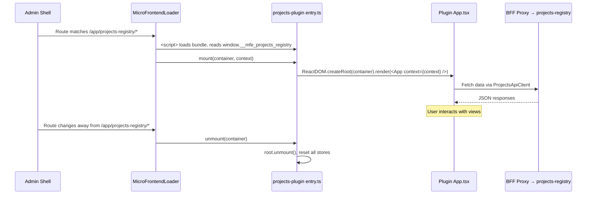

# Design Document — admin-projects-management

## Overview

This design describes the projects management micro-frontend plugin for the `ugsys-admin-panel`. The plugin is a React 19 + TypeScript single-bundle application built with Vite, loaded at runtime by the admin shell's `MicroFrontendLoader` via a `<script>` tag. It provides full CRUD for projects, subscription management, a visual form schema editor, and an admin dashboard with analytics.

The plugin communicates exclusively through the BFF proxy at `/api/v1/proxy/projects-registry/{path}` and follows the admin shell's hexagonal architecture: `domain/` for entities, type contracts, and pure functions (validation, field diffing), `infrastructure/` for the typed API client, and `presentation/` for React components, hooks, and nanostores atoms.

The plugin consumes `ugsys-ui-lib` design tokens (`tokens.css`) and the shared Tailwind preset for consistent theming with the admin shell and other plugins.

### Key design decisions

- **Standalone Vite bundle, no shared React instance**: The plugin bundles its own React copy. The admin shell loads it via `<script>` tag and retrieves the module from `window.__mfe_projects_registry`. This avoids version coupling between shell and plugin.
- **nanostores for state**: Consistent with the admin shell's `authStore.ts` and `registryStore.ts` patterns. Each functional area (projects list, detail, subscriptions, form schema, dashboard) gets its own atom.
- **Path-based routing via `MicroFrontendContext.navigate`**: The plugin does not use its own `BrowserRouter`. Instead, it reads the current URL path and calls `context.navigate()` for transitions, staying within the shell's SPA router.
- **Typed API client with BFF proxy**: A single `ProjectsApiClient` class wraps all backend endpoints, routing through the BFF proxy. It handles auth headers, error classification (401/403/404/5xx), and correlation ID propagation.
- **Form validation is pure functions in domain layer**: Validation logic (required fields, date ordering, positive integers, poll option counts) lives in `domain/` as pure functions, testable without React.
- **Store reset on unmount**: The `unmount()` function resets all nanostores atoms to initial values, preventing stale state when the plugin is re-mounted after navigation away and back.

---

## Architecture

The plugin lives in a new directory `ugsys-admin-panel/projects-plugin/` alongside the existing `admin-shell/`. It is built independently and produces a single JS bundle deployed to the projects-registry CloudFront distribution.

```
ugsys-admin-panel/
├── admin-shell/                    ← existing admin shell SPA
├── projects-plugin/                ← NEW — this feature
│   ├── src/
│   │   ├── domain/
│   │   │   ├── entities/
│   │   │   │   ├── Project.ts          # Project, ProjectImage, ProjectStatus
│   │   │   │   ├── Subscription.ts     # Subscription, SubscriptionStatus
│   │   │   │   ├── FormSchema.ts       # FormSchema, CustomField, FieldType
│   │   │   │   ├── Dashboard.ts        # DashboardMetrics, ProjectStats, AnalyticsData
│   │   │   │   └── Pagination.ts       # PaginatedResponse<T>, PaginatedQuery
│   │   │   ├── validation.ts           # Pure validation functions
│   │   │   ├── diffUtils.ts            # computeModifiedFields — pure diff function
│   │   │   └── repositories/
│   │   │       └── ProjectsRepository.ts  # Interface (TypeScript interface)
│   │   ├── infrastructure/
│   │   │   └── api/
│   │   │       └── ProjectsApiClient.ts   # Concrete API client via BFF proxy
│   │   └── presentation/
│   │       ├── components/
│   │       │   ├── ProjectList.tsx
│   │       │   ├── ProjectForm.tsx        # Shared create/edit form
│   │       │   ├── ProjectDetail.tsx
│   │       │   ├── SubscriptionManager.tsx
│   │       │   ├── FormSchemaEditor.tsx
│   │       │   ├── Dashboard.tsx
│   │       │   ├── Toast.tsx
│   │       │   ├── ConfirmDialog.tsx
│   │       │   └── NotFound.tsx
│   │       ├── hooks/
│   │       │   └── usePluginRouter.ts     # URL-based routing via context.navigate
│   │       ├── stores/
│   │       │   ├── projectListStore.ts
│   │       │   ├── projectDetailStore.ts
│   │       │   ├── subscriptionStore.ts
│   │       │   ├── formSchemaStore.ts
│   │       │   ├── dashboardStore.ts
│   │       │   └── toastStore.ts
│   │       └── App.tsx                    # Root component with route matching
│   ├── entry.ts                           # mount/unmount + window.__mfe_ assignment
│   ├── package.json
│   ├── tsconfig.json
│   └── vite.config.ts                     # Library mode, single bundle output
```

### Layer dependency rules

```
presentation  →  domain  (types, validation)
presentation  →  infrastructure  (API client)
infrastructure  →  domain  (implements repository interface, uses entity types)
domain  →  (nothing — zero external imports)
```

This mirrors the admin shell's own dependency direction: `presentation/components/` → `stores/` → `infrastructure/repositories/` → `domain/entities/`.

### Plugin lifecycle



### Request flow (API calls)

```
Plugin Component
    │  calls store action (e.g. loadProjects)
    ▼
nanostores action
    │  calls ProjectsApiClient method
    ▼
ProjectsApiClient
    │  fetch(`/api/v1/proxy/projects-registry/api/v1/projects/...`)
    │  Headers: Authorization: Bearer <token>, X-Request-ID: <correlationId>
    ▼
Admin Shell BFF Proxy
    │  forwards to projects-registry backend
    ▼
projects-registry FastAPI
    │  processes request
    ▼
Response flows back through the same chain
```

---

## Components and Interfaces

### `entry.ts` — Plugin entry point

Exports `mount` and `unmount`, assigns to `window.__mfe_projects_registry`.

```typescript
// entry.ts
import { createRoot, Root } from 'react-dom/client';
import { App } from './presentation/App';
import { resetAllStores } from './presentation/stores';
import type { MicroFrontendContext } from './domain/entities/Context';

let root: Root | null = null;

export function mount(container: HTMLElement, context: MicroFrontendContext): void {
  root = createRoot(container);
  root.render(<App context={context} />);
}

export function unmount(container: HTMLElement): void {
  root?.unmount();
  root = null;
  resetAllStores();
}

// Assign to global for script-tag loading
(window as any).__mfe_projects_registry = { mount, unmount };
```

### `domain/repositories/ProjectsRepository.ts` — Port interface

```typescript
export interface ProjectsRepository {
  listProjects(query: PaginatedQuery): Promise<PaginatedResponse<Project>>;
  createProject(data: CreateProjectData): Promise<Project>;
  getProject(id: string): Promise<Project>;
  getEnhancedProject(id: string): Promise<Project>;
  updateProject(id: string, data: Partial<ProjectUpdateData>): Promise<Project>;
  deleteProject(id: string): Promise<void>;
  listSubscriptions(projectId: string, page: number, pageSize: number): Promise<PaginatedResponse<Subscription>>;
  approveSubscription(projectId: string, subscriptionId: string): Promise<Subscription>;
  rejectSubscription(projectId: string, subscriptionId: string, reason?: string): Promise<Subscription>;
  cancelSubscription(projectId: string, subscriptionId: string): Promise<void>;
  updateFormSchema(projectId: string, fields: CustomField[]): Promise<FormSchema>;
  getDashboard(): Promise<EnhancedDashboardData>;
  getAnalytics(): Promise<AnalyticsData>;
}
```

### `infrastructure/api/ProjectsApiClient.ts` — Concrete API client

Implements `ProjectsRepository`. All requests go through the BFF proxy. Handles error classification.

```typescript
const PROXY_BASE = '/api/v1/proxy/projects-registry';

export class ProjectsApiClient implements ProjectsRepository {
  private getAccessToken: () => string | null;
  private correlationId?: string;

  constructor(getAccessToken: () => string | null) {
    this.getAccessToken = getAccessToken;
  }

  private async request<T>(method: string, path: string, body?: unknown): Promise<T> {
    const url = `${PROXY_BASE}/${path}`;
    const headers: Record<string, string> = { 'Content-Type': 'application/json' };

    const token = this.getAccessToken();
    if (token) headers['Authorization'] = `Bearer ${token}`;
    if (this.correlationId) headers['X-Request-ID'] = this.correlationId;

    // CSRF token for state-changing operations (POST, PUT, PATCH, DELETE)
    const STATE_CHANGING_METHODS = new Set(['POST', 'PUT', 'PATCH', 'DELETE']);
    if (STATE_CHANGING_METHODS.has(method.toUpperCase())) {
      const csrfToken = this.getCsrfTokenFromCookie();
      if (csrfToken) headers['X-CSRF-Token'] = csrfToken;
    }

    const response = await fetch(url, {
      method,
      headers,
      body: body ? JSON.stringify(body) : undefined,
    });

    if (!response.ok) {
      throw await this.classifyError(response);
    }

    if (response.status === 204) return undefined as T;
    const json = await response.json();
    return json.data ?? json;
  }

  private async classifyError(response: Response): Promise<ApiError> {
    // Returns typed error with status, code, and user-safe message
    // 401 → SessionExpiredError, 403 → AccessDeniedError,
    // 404 → NotFoundError, 5xx → ServerError
  }

  private getCsrfTokenFromCookie(): string | null {
    const match = document.cookie
      .split('; ')
      .find((row) => row.startsWith('csrf_token='));
    return match ? decodeURIComponent(match.split('=')[1]) : null;
  }

  // ... method implementations delegate to this.request()
}
```

### `domain/validation.ts` — Pure validation functions

```typescript
export interface ValidationResult {
  valid: boolean;
  errors: Record<string, string>;
}

export function validateProjectForm(data: ProjectFormData): ValidationResult { ... }
export function validateFormSchema(fields: CustomField[]): ValidationResult { ... }
```

Key validation rules:
- `name`, `description`, `category`, `start_date`, `end_date`, `max_participants` are required
- `max_participants` must be a positive integer (> 0)
- `end_date` must be >= `start_date` (ISO string comparison)
- Every `CustomField` must have a non-empty `question`
- `poll_single` / `poll_multiple` fields must have >= 2 options

### `presentation/hooks/usePluginRouter.ts` — URL-based routing

The plugin reads `window.location.pathname` to determine which view to render. The base path is `/app/projects-registry`. Route matching:

| URL pattern | Component |
|---|---|
| `/app/projects-registry/projects` | ProjectList |
| `/app/projects-registry/projects/new` | ProjectForm (create mode) |
| `/app/projects-registry/projects/:id` | ProjectDetail |
| `/app/projects-registry/projects/:id/edit` | ProjectForm (edit mode) |
| `/app/projects-registry/projects/:id/subscriptions` | SubscriptionManager |
| `/app/projects-registry/projects/:id/form-schema` | FormSchemaEditor |
| `/app/projects-registry/` (root) | Dashboard |
| `/app/projects-registry/dashboard` | Dashboard (alias) |
| anything else | NotFound |

Navigation calls `context.navigate(path)` which delegates to the shell's `useNavigate()`.

Store actions that fetch data (e.g. `loadProjects`) accept an optional `AbortSignal` parameter. The `projectListStore` creates a new `AbortController` on each filter/sort/page change, aborting the previous in-flight request. Text-based filter inputs (name search, category) are debounced at 300ms before triggering a fetch.

### `presentation/stores/` — nanostores atoms

Each store follows the admin shell pattern (see `authStore.ts`, `registryStore.ts`):

| Store | Atom shape | Purpose |
|---|---|---|
| `projectListStore` | `{ items: Project[], total: number, page: number, pageSize: number, filters: {...}, sort: {...}, loading: boolean, error: string \| null }` | Projects list with pagination/filter/sort state |
| `projectDetailStore` | `{ project: Project \| null, loading: boolean, error: string \| null }` | Currently viewed project |
| `subscriptionStore` | `{ items: Subscription[], total: number, page: number, pageSize: number, loading: boolean, error: string \| null, actionLoading: string \| null }` | Subscriptions for a project |
| `formSchemaStore` | `{ fields: CustomField[], loading: boolean, saving: boolean, error: string \| null }` | Form schema editor state |
| `dashboardStore` | `{ metrics: EnhancedDashboardData \| null, analytics: AnalyticsData \| null, loading: boolean, error: string \| null }` | Dashboard metrics and analytics |
| `toastStore` | `{ queue: Array<{ id: string, message: string, type: 'success' \| 'error' }>, visible: boolean }` | Toast notification queue (FIFO, max 3 visible) |

`resetAllStores()` sets every atom back to its initial value — called from `unmount()`.

---

## Data Models

### Domain entities (TypeScript interfaces in `domain/entities/`)

```typescript
// Project.ts
export type ProjectStatus = 'pending' | 'active' | 'completed' | 'cancelled';

export interface ProjectImage {
  image_id: string;
  filename: string;
  content_type: string;
  cloudfront_url: string;
  uploaded_at: string;
}

export interface Project {
  id: string;
  name: string;
  description: string;
  rich_text: string;
  category: string;
  status: ProjectStatus;
  is_enabled: boolean;
  max_participants: number;
  current_participants: number;
  start_date: string;
  end_date: string;
  created_by: string;
  notification_emails: string[];
  images: ProjectImage[];
  form_schema: FormSchema | null;
  created_at: string;
  updated_at: string;
}

// Subscription.ts
export type SubscriptionStatus = 'pending' | 'active' | 'rejected' | 'cancelled';

export interface Subscription {
  id: string;
  project_id: string;
  person_id: string;
  status: SubscriptionStatus;
  notes?: string;
  created_at: string;
  updated_at: string;
}

// FormSchema.ts
export type FieldType = 'text' | 'textarea' | 'poll_single' | 'poll_multiple' | 'date' | 'number';

export interface CustomField {
  id: string;
  field_type: FieldType;
  question: string;
  required: boolean;
  options: string[];
}

export interface FormSchema {
  fields: CustomField[];
}

// Dashboard.ts
export interface ProjectStats {
  project_id: string;
  project_name: string;
  subscription_count: number;
  active_count: number;
  pending_count: number;
}

export interface EnhancedDashboardData {
  total_projects: number;
  total_subscriptions: number;
  total_form_submissions: number;
  active_projects: number;
  pending_subscriptions: number;
  per_project_stats: ProjectStats[];
  recent_signups: Subscription[];
}

export interface AnalyticsData {
  subscriptions_by_status: Record<string, number>;
  projects_by_status: Record<string, number>;
  subscriptions_by_project: Record<string, number>;
}

// Pagination.ts
export interface PaginatedResponse<T> {
  items: T[];
  total: number;
  page: number;
  page_size: number;
}

export interface PaginatedQuery {
  page: number;
  page_size: number;
  status?: ProjectStatus;
  category?: string;
  search?: string;
  sort_by: string;
  sort_order: 'asc' | 'desc';
}
```

### API request/response mapping

| Plugin method | HTTP | BFF proxy path | Request body | Response shape |
|---|---|---|---|---|
| `listProjects(query)` | GET | `api/v1/projects/?page=&page_size=&status=&category=&search=&sort_by=&sort_order=` | — | `{ data: { items: Project[], total, page, page_size } }` |
| `createProject(data)` | POST | `api/v1/projects/` | `CreateProjectRequest` | `{ data: Project }` |
| `getProject(id)` | GET | `api/v1/projects/{id}` | — | `{ data: Project }` |
| `getEnhancedProject(id)` | GET | `api/v1/projects/{id}/enhanced` | — | `{ data: Project }` |
| `updateProject(id, data)` | PUT | `api/v1/projects/{id}` | `UpdateProjectRequest` | `{ data: Project }` |
| `deleteProject(id)` | DELETE | `api/v1/projects/{id}` | — | 204 No Content |
| `listSubscriptions(pid, page, size)` | GET | `api/v1/projects/{pid}/subscriptions?page=&page_size=` | — | `{ data: { items: Subscription[], total, page, page_size } }` |
| `approveSubscription(pid, sid)` | PUT | `api/v1/projects/{pid}/subscribers/{sid}` | `{ action: "approve" }` | `{ data: Subscription }` |
| `rejectSubscription(pid, sid, reason)` | PUT | `api/v1/projects/{pid}/subscribers/{sid}` | `{ action: "reject", reason }` | `{ data: Subscription }` |
| `cancelSubscription(pid, sid)` | DELETE | `api/v1/projects/{pid}/subscribers/{sid}` | — | 204 No Content |
| `updateFormSchema(pid, fields)` | PUT | `api/v1/projects/{pid}/form-schema` | `{ fields: CustomField[] }` | `{ data: FormSchema }` |
| `getDashboard()` | GET | `api/v1/admin/dashboard/enhanced` | — | `{ data: EnhancedDashboardData }` |
| `getAnalytics()` | GET | `api/v1/admin/analytics` | — | `{ data: AnalyticsData }` |

---

## Correctness Properties

*A property is a characteristic or behavior that should hold true across all valid executions of a system — essentially, a formal statement about what the system should do. Properties serve as the bridge between human-readable specifications and machine-verifiable correctness guarantees.*

### Property 1: Project form validation rejects invalid input

*For any* project form data where any required field (name, description, category, start_date, end_date, max_participants) is missing or empty, OR where max_participants is not a positive integer, OR where end_date is earlier than start_date, the `validateProjectForm` function should return `{ valid: false }` with at least one error entry.

**Validates: Requirements 3.2, 3.3, 3.4, 4.5**

### Property 2: Project form validation accepts valid input

*For any* project form data where all required fields are non-empty, max_participants is a positive integer, and end_date >= start_date, the `validateProjectForm` function should return `{ valid: true, errors: {} }`.

**Validates: Requirements 3.2, 3.3, 3.4, 4.5**

### Property 3: Form schema validation

*For any* list of CustomField entries, `validateFormSchema` should return `{ valid: false }` if any field has an empty or whitespace-only question, OR if any field with field_type `poll_single` or `poll_multiple` has fewer than 2 options. Otherwise it should return `{ valid: true }`.

**Validates: Requirements 7.14, 7.15**

### Property 4: Subscription action visibility is determined by status

*For any* subscription, the set of available actions should be: if status is `pending` → {approve, reject, cancel}; if status is `active` → {cancel}; if status is `rejected` or `cancelled` → {} (no actions). The function `getAvailableActions(status)` should return the correct set for every valid SubscriptionStatus.

**Validates: Requirements 6.4, 6.7**

### Property 5: API request construction

*For any* API client method call, the resulting HTTP request URL should start with `/api/v1/proxy/projects-registry/`, the `Authorization` header should contain the token returned by `getAccessToken()` (when non-null), the `X-Request-ID` header should be present, and for state-changing methods (POST, PUT, PATCH, DELETE) the `X-CSRF-Token` header should contain the value read from the `csrf_token` cookie (when present).

**Validates: Requirements 10.1, 10.2, 10.8, 10.9**

### Property 6: HTTP error classification

*For any* HTTP error response, the API client should classify it as: 401 → `SessionExpiredError`, 403 → `AccessDeniedError`, 404 → `NotFoundError`, 500-599 → `ServerError`. The error's user-facing message should never contain the raw response body or stack traces.

**Validates: Requirements 10.4, 10.5, 10.6, 10.7**

### Property 7: Edit form sends only modified fields

*For any* original project and any set of edits applied to the form, the PUT request body should contain only the fields whose values differ from the original project. Unchanged fields should not be present in the request body.

**Validates: Requirements 4.6**

### Property 8: URL query string round-trip for project list filters

*For any* combination of filter state (status, category), sort state (sort_by, sort_order), and pagination state (page, page_size), serializing the state to URL query parameters and parsing it back should produce an equivalent state object.

**Validates: Requirements 9.4**

### Property 9: Route matching maps paths to correct views

*For any* path in the set of known plugin routes (`/projects`, `/projects/new`, `/projects/:id`, `/projects/:id/edit`, `/projects/:id/subscriptions`, `/projects/:id/form-schema`, `/` for dashboard), the route matcher should return the correct view identifier. *For any* path not matching a known route, the matcher should return `not-found`.

**Validates: Requirements 9.1, 9.3**

### Property 10: Store reset on unmount clears all state

*For any* state that has been set in any of the plugin's nanostores atoms (projectListStore, projectDetailStore, subscriptionStore, formSchemaStore, dashboardStore, toastStore), calling `resetAllStores()` should set every atom back to its initial default value.

**Validates: Requirements 11.6**

### Property 11: Unique field IDs for new custom fields

*For any* number N of new CustomField entries created via the "Add Field" action, all N generated IDs should be distinct from each other.

**Validates: Requirements 7.9**

### Property 12: Poll field options editor visibility

*For any* CustomField, the options editor should be visible if and only if the field_type is `poll_single` or `poll_multiple`. For field types `text`, `textarea`, `date`, and `number`, the options editor should not be rendered.

**Validates: Requirements 7.6**

### Property 13: API query parameters match filter/sort/page state

*For any* project list query state (page, page_size, status filter, category filter, sort_by, sort_order), the API client's `listProjects` method should construct a request URL whose query parameters exactly encode that state.

**Validates: Requirements 2.7**

### Property 14: Error messages do not expose internal server details

*For any* API error response containing an `error` code and a `message` field, the user-facing error message displayed by the plugin should be the `message` from the response envelope (the user-safe message), and should never contain substrings like `Traceback`, `DynamoDB`, `ClientError`, file paths, or stack traces.

**Validates: Requirements 12.3**

---

## Error Handling

### Error classification strategy

The API client classifies errors by HTTP status code and wraps them in typed error objects:

| HTTP Status | Error Type | User Message | Retry? |
|---|---|---|---|
| 401 | `SessionExpiredError` | "Your session has expired. Please log in again." | No |
| 403 | `AccessDeniedError` | "You don't have permission to perform this action." | No |
| 404 | `NotFoundError` | "The requested resource was not found." | No |
| 422 | `ValidationError` | Message from API response `message` field | No |
| 500-599 | `ServerError` | "An unexpected error occurred. Please try again." | Yes |
| Network error | `NetworkError` | "Unable to connect. Check your network and try again." | Yes |

### Error display patterns

| Context | Display method |
|---|---|
| Page load failure (list, detail, dashboard) | Inline error banner with retry button replacing the content area |
| Form submission failure (create, edit, form schema) | Inline error banner above the form; validation errors shown per-field |
| Action failure (delete, approve, reject, cancel) | Toast notification with error message |
| Session expired (401) | Toast notification + disable further actions |

### Retry behavior

- Page loads: Retry button re-triggers the store's fetch action
- Form submissions: The form stays populated; the admin can fix and resubmit
- Actions: The admin can click the action button again after the error toast dismisses
- 401: No retry — the admin must re-authenticate via the shell

### Confirmation dialogs

Delete operations (project delete, subscription cancel) require explicit confirmation via a modal dialog with:
- Clear description of the action ("Delete project X?", "Cancel subscription for user Y?")
- "Confirm" and "Cancel" buttons
- `role="dialog"` with `aria-labelledby` for accessibility
- Focus trapped within the dialog while open
- Action button disabled while the API request is in progress

---

## Testing Strategy

### Dual testing approach

Both unit tests and property-based tests are required. They complement each other:
- **Unit tests**: Verify specific examples, edge cases, UI rendering, and integration points
- **Property tests**: Verify universal invariants across randomly generated inputs

### Testing library stack

| Tool | Purpose |
|---|---|
| `vitest` | Test runner (already in admin-shell devDependencies) |
| `fast-check` | Property-based testing library (already in admin-shell devDependencies, v3.23.1) |
| `@testing-library/react` | Component rendering and interaction (already in admin-shell devDependencies) |
| `msw` | API mocking for integration tests (already in admin-shell devDependencies) |

### Property-based tests

Each correctness property maps to a single `fast-check` property test. Minimum 100 iterations per test via `fc.assert(fc.property(...), { numRuns: 100 })`.

Each test is tagged with a comment referencing the design property:

```typescript
// Feature: admin-projects-management, Property 1: Project form validation rejects invalid input
```

| Property | Test file | Generator strategy |
|---|---|---|
| P1: Form validation rejects invalid | `domain/validation.property.test.ts` | `fc.record` with at least one required field empty, or max_participants <= 0, or end_date < start_date |
| P2: Form validation accepts valid | `domain/validation.property.test.ts` | `fc.record` with all fields valid, max_participants > 0, end_date >= start_date |
| P3: Form schema validation | `domain/validation.property.test.ts` | `fc.array(customFieldArb)` with random empty questions or poll fields with < 2 options |
| P4: Subscription action visibility | `domain/entities/Subscription.property.test.ts` | `fc.constantFrom('pending', 'active', 'rejected', 'cancelled')` |
| P5: API request construction | `infrastructure/api/ProjectsApiClient.property.test.ts` | `fc.record` of method name + random params, verify URL/headers via fetch mock |
| P6: HTTP error classification | `infrastructure/api/ProjectsApiClient.property.test.ts` | `fc.constantFrom(401, 403, 404, 500, 502, 503)` + random response bodies |
| P7: Edit sends only modified fields | `domain/diffUtils.property.test.ts` | `fc.record` for original project + `fc.record` for edits, compute diff |
| P8: URL query string round-trip | `presentation/hooks/usePluginRouter.property.test.ts` | `fc.record` of filter/sort/page state, serialize → parse → compare |
| P9: Route matching | `presentation/hooks/usePluginRouter.property.test.ts` | `fc.constantFrom(knownRoutes)` + `fc.string()` for unknown paths |
| P10: Store reset | `presentation/stores/resetStores.property.test.ts` | `fc.record` of random state values, set in atoms, call reset, verify initial |
| P11: Unique field IDs | `domain/entities/FormSchema.property.test.ts` | `fc.integer({ min: 1, max: 50 })` for count, generate N IDs, check uniqueness |
| P12: Poll options editor visibility | `domain/entities/FormSchema.property.test.ts` | `fc.constantFrom('text', 'textarea', 'poll_single', 'poll_multiple', 'date', 'number')` |
| P13: API query params match state | `infrastructure/api/ProjectsApiClient.property.test.ts` | `fc.record` of query state, verify URL params |
| P14: Error messages safe | `infrastructure/api/ProjectsApiClient.property.test.ts` | `fc.record` with random error bodies containing forbidden substrings, verify they're stripped |

### Unit tests (specific examples and edge cases)

| Area | Test file | Key test cases |
|---|---|---|
| Plugin entry | `entry.test.ts` | mount renders content, unmount clears container, window global assigned |
| Project list | `presentation/components/ProjectList.test.tsx` | Renders project rows, loading skeleton, error with retry, pagination controls |
| Project form | `presentation/components/ProjectForm.test.tsx` | Create mode renders empty form, edit mode pre-populates, validation errors shown, submit calls API |
| Project detail | `presentation/components/ProjectDetail.test.tsx` | Renders all fields, form schema preview, action buttons, delete confirmation |
| Subscription manager | `presentation/components/SubscriptionManager.test.tsx` | Renders subscription rows, approve/reject/cancel actions, pagination |
| Form schema editor | `presentation/components/FormSchemaEditor.test.tsx` | Add/remove fields, reorder, poll options editor, save calls API |
| Dashboard | `presentation/components/Dashboard.test.tsx` | Renders metric cards, loading state, error with retry |
| API client | `infrastructure/api/ProjectsApiClient.test.ts` | Each method calls correct endpoint, handles 204, unwraps envelope |
| Stores | `presentation/stores/*.test.ts` | Load actions update atoms, error handling, loading states |
| Toast | `presentation/components/Toast.test.tsx` | Shows message, auto-dismisses after 5s, accessible via aria-live |

### Architecture guard

A CI check should verify the plugin's layer boundaries:

```bash
# domain/ must not import from infrastructure/ or presentation/
grep -rn "from.*infrastructure\|from.*presentation" projects-plugin/src/domain/
# must return empty
```

### Coverage targets

- Domain layer (validation, entities): 90%+
- Infrastructure layer (API client): 80%+
- Presentation layer (components, stores, hooks): 80%+
- Overall plugin: 80% minimum (CI gate)
