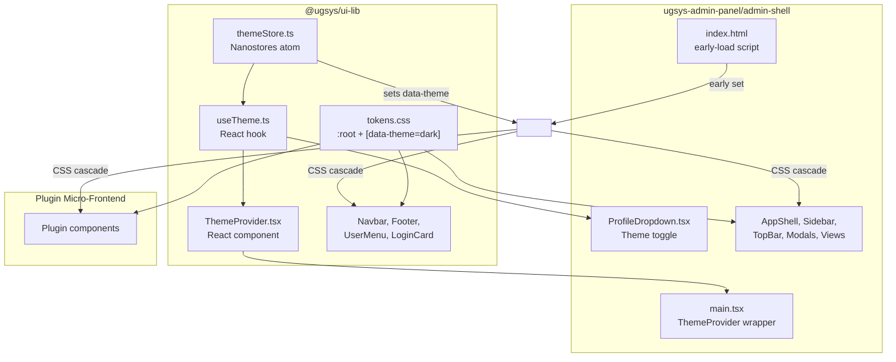
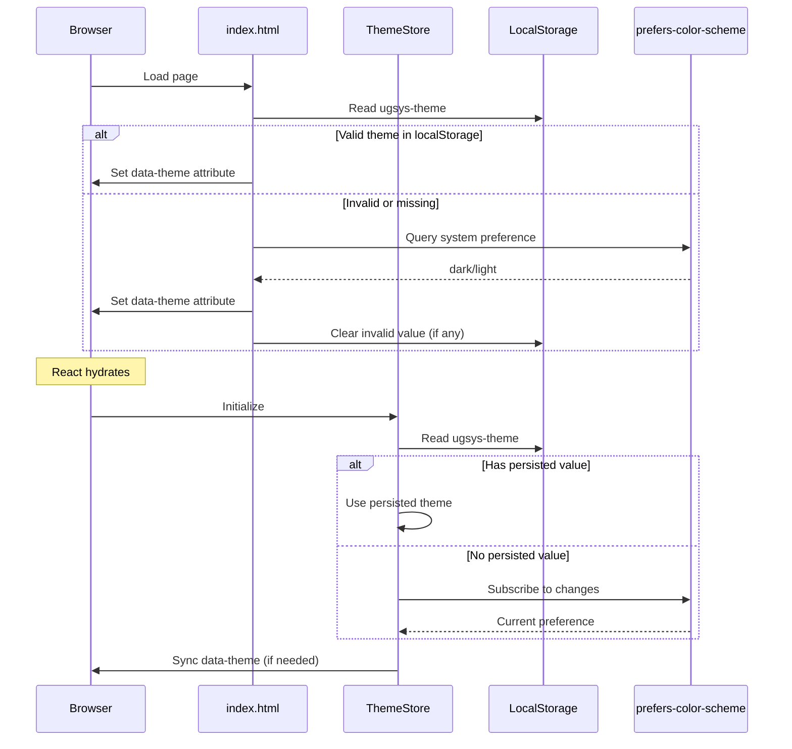

# Design Document: Admin Theme Switcher

## Overview

This design implements a cross-frontend dark/light theme switching system for the ugsys platform. The solution spans two packages:

1. **`@ugsys/ui-lib`** (shared library): Provides the foundational theming infrastructure including design tokens, theme state management via Nanostores, and a ThemeProvider component. All exported components (Navbar, Footer, UserMenu, LoginCard) are updated to use semantic CSS custom properties.

2. **`ugsys-admin-panel`** (consumer): Integrates the shared theming system by wiring ThemeProvider at the app root, adding a theme toggle to ProfileDropdown, migrating hardcoded colors to semantic tokens, and implementing an early-load script to prevent flash of wrong theme.

Plugin micro-frontends automatically inherit the theme via the `data-theme` attribute on `<html>`, requiring no theme logic of their own.

### Key Design Decisions

1. **Nanostores for state management**: Already used in admin-shell for auth and registry stores. Provides reactive atoms with minimal bundle size (~1KB).

2. **CSS custom properties for theming**: Enables instant theme switching without React re-renders. Components respond to `data-theme` attribute changes via CSS cascade.

3. **`data-theme` attribute on `<html>`**: Standard pattern that works across shadow DOM boundaries and Module Federation remotes.

4. **localStorage key `ugsys-theme`**: Platform-wide persistence ensures consistent theme across all ugsys frontends.

5. **Early-load inline script**: Prevents flash of wrong theme by applying the theme before React hydrates.

## Architecture



### Theme Resolution Flow



## Components and Interfaces

### UI_Lib Exports

#### `themeStore.ts` — Theme State Management

```typescript
// src/theme/themeStore.ts
import { atom, onMount } from "nanostores";

export type Theme = "light" | "dark";

const STORAGE_KEY = "ugsys-theme";

/** Reactive atom holding current theme */
export const $theme = atom<Theme>("light");

/** Internal flag: true if user has manually toggled */
let userHasToggled = false;

/** MediaQueryList for system preference */
let mediaQuery: MediaQueryList | null = null;

/** Apply theme to DOM */
function applyTheme(theme: Theme): void {
  document.documentElement.setAttribute("data-theme", theme);
}

/** Persist theme to localStorage */
function persistTheme(theme: Theme): void {
  try {
    localStorage.setItem(STORAGE_KEY, theme);
  } catch {
    // localStorage unavailable (private browsing, quota exceeded)
  }
}

/** Read persisted theme, returns null if invalid/missing */
function readPersistedTheme(): Theme | null {
  try {
    const value = localStorage.getItem(STORAGE_KEY);
    if (value === "light" || value === "dark") return value;
    if (value !== null) localStorage.removeItem(STORAGE_KEY); // Clear invalid
    return null;
  } catch {
    return null;
  }
}

/** Get system preference */
function getSystemPreference(): Theme {
  if (typeof window === "undefined") return "light";
  return window.matchMedia("(prefers-color-scheme: dark)").matches
    ? "dark"
    : "light";
}

/** Handle system preference change */
function handleSystemChange(e: MediaQueryListEvent): void {
  if (userHasToggled) return; // User override takes precedence
  const theme = e.matches ? "dark" : "light";
  $theme.set(theme);
  applyTheme(theme);
}

/** Toggle between light and dark */
export function toggleTheme(): void {
  userHasToggled = true;
  // Stop listening to system preference
  if (mediaQuery) {
    mediaQuery.removeEventListener("change", handleSystemChange);
    mediaQuery = null;
  }
  const next = $theme.get() === "light" ? "dark" : "light";
  $theme.set(next);
  applyTheme(next);
  persistTheme(next);
}

/** Initialize theme store */
export function initializeTheme(defaultTheme?: Theme): void {
  const persisted = readPersistedTheme();
  
  if (persisted) {
    userHasToggled = true; // Treat persisted as user choice
    $theme.set(persisted);
    applyTheme(persisted);
    return;
  }

  // No persisted value — use system preference
  const systemPref = getSystemPreference();
  const initial = defaultTheme ?? systemPref;
  $theme.set(initial);
  applyTheme(initial);

  // Listen for system preference changes
  if (typeof window !== "undefined") {
    mediaQuery = window.matchMedia("(prefers-color-scheme: dark)");
    mediaQuery.addEventListener("change", handleSystemChange);
  }
}

// Auto-initialize on first subscriber (SSR-safe)
onMount($theme, () => {
  if (typeof window !== "undefined" && !userHasToggled) {
    initializeTheme();
  }
  return () => {
    if (mediaQuery) {
      mediaQuery.removeEventListener("change", handleSystemChange);
      mediaQuery = null;
    }
  };
});
```

#### `useTheme.ts` — React Hook

```typescript
// src/theme/useTheme.ts
import { useStore } from "@nanostores/react";
import { $theme, toggleTheme, type Theme } from "./themeStore";

export interface UseThemeReturn {
  theme: Theme;
  toggleTheme: () => void;
}

export function useTheme(): UseThemeReturn {
  const theme = useStore($theme);
  return { theme, toggleTheme };
}
```

#### `ThemeProvider.tsx` — React Component

```typescript
// src/theme/ThemeProvider.tsx
import { useEffect, type ReactNode } from "react";
import { initializeTheme, type Theme } from "./themeStore";

export interface ThemeProviderProps {
  children: ReactNode;
  defaultTheme?: Theme;
}

export function ThemeProvider({
  children,
  defaultTheme,
}: ThemeProviderProps): ReactNode {
  useEffect(() => {
    initializeTheme(defaultTheme);
  }, [defaultTheme]);

  return children;
}
```

#### Updated `src/index.ts` Exports

```typescript
// Existing exports
export { Navbar } from "./components/Navbar";
export { Footer } from "./components/Footer";
export { UserMenu } from "./components/UserMenu";
export { LoginCard } from "./components/LoginCard";
export type { LoginCardProps } from "./components/LoginCard";
export { useFocusManagement } from "./hooks/useFocusManagement";
export type { RenderLink, LinkItem, UserInfo, ExtraMenuItem } from "./types";
export { defaultRenderLink } from "./types";

// New theme exports
export { ThemeProvider } from "./theme/ThemeProvider";
export type { ThemeProviderProps } from "./theme/ThemeProvider";
export { useTheme } from "./theme/useTheme";
export type { UseThemeReturn } from "./theme/useTheme";
export { $theme, toggleTheme, initializeTheme } from "./theme/themeStore";
export type { Theme } from "./theme/themeStore";
```

### Admin Shell Components

#### Updated `ProfileDropdown.tsx`

```typescript
// Theme toggle menu item added before Logout
import { useTheme } from "@ugsys/ui-lib";

// Inside ProfileDropdown component:
const { theme, toggleTheme } = useTheme();

// Render theme toggle before logout button:
<button
  role="menuitem"
  aria-label={theme === "light" ? "Switch to dark theme" : "Switch to light theme"}
  onClick={toggleTheme}
  className="w-full text-left px-4 py-2 text-sm text-gray-700 hover:bg-gray-50 focus:outline-none focus:bg-gray-50 flex items-center gap-2"
>
  {theme === "light" ? (
    <>
      <MoonIcon aria-hidden="true" />
      Dark
    </>
  ) : (
    <>
      <SunIcon aria-hidden="true" />
      Light
    </>
  )}
</button>
```

#### Early-Load Script in `index.html`

```html
<!doctype html>
<html lang="en">
  <head>
    <meta charset="UTF-8" />
    <meta name="viewport" content="width=device-width, initial-scale=1.0" />
    <title>ugsys Admin Panel</title>
    <script>
      // Early theme application to prevent flash
      (function() {
        var STORAGE_KEY = "ugsys-theme";
        var theme;
        try {
          var stored = localStorage.getItem(STORAGE_KEY);
          if (stored === "light" || stored === "dark") {
            theme = stored;
          } else {
            if (stored !== null) localStorage.removeItem(STORAGE_KEY);
            theme = window.matchMedia("(prefers-color-scheme: dark)").matches
              ? "dark"
              : "light";
          }
        } catch (e) {
          theme = window.matchMedia("(prefers-color-scheme: dark)").matches
            ? "dark"
            : "light";
        }
        document.documentElement.setAttribute("data-theme", theme);
      })();
    </script>
  </head>
  <body>
    <div id="root"></div>
    <script type="module" src="/src/main.tsx"></script>
  </body>
</html>
```

#### Updated `main.tsx`

```typescript
import React from "react";
import ReactDOM from "react-dom/client";
import { ThemeProvider } from "@ugsys/ui-lib";
import { enableSecureLogging } from "./utils/secureLogging";
import { App } from "./App";
import "./index.css";

enableSecureLogging();

const rootElement = document.getElementById("root");
if (!rootElement) {
  throw new Error('Root element #root not found.');
}

ReactDOM.createRoot(rootElement).render(
  <React.StrictMode>
    <ThemeProvider>
      <App />
    </ThemeProvider>
  </React.StrictMode>,
);
```

## Data Models

### Theme Type

```typescript
export type Theme = "light" | "dark";
```

### Design Token Structure

The tokens follow a semantic naming convention that maps to concrete values per theme:

| Token | Light Value | Dark Value | Usage |
|-------|-------------|------------|-------|
| `--color-surface` | `#ffffff` | `#1e2738` | Main content background |
| `--color-surface-elevated` | `#f9fafb` | `#252f3f` | Cards, modals, dropdowns |
| `--color-text-primary` | `#111827` | `#f9fafb` | Primary text |
| `--color-text-secondary` | `#4b5563` | `#9ca3af` | Secondary text |
| `--color-text-muted` | `#9ca3af` | `#6b7280` | Muted/disabled text |
| `--color-border` | `#e5e7eb` | `#374151` | Borders, dividers |
| `--color-input-bg` | `#ffffff` | `#1f2937` | Input backgrounds |
| `--color-input-border` | `#d1d5db` | `#4b5563` | Input borders |
| `--color-error` | `#dc2626` | `#f87171` | Error text |
| `--color-error-bg` | `#fef2f2` | `#450a0a` | Error backgrounds |
| `--color-error-border` | `#fecaca` | `#7f1d1d` | Error borders |

### Brand Token Overrides (Dark Theme)

| Token | Light Value | Dark Value | Notes |
|-------|-------------|------------|-------|
| `--color-primary` | `#161d2b` | `#0f1419` | Darker in dark mode |
| `--color-background` | `#f8f8f8` | `#111827` | Page background |
| `--color-footer` | `#131929` | `#0a0e14` | Footer background |

### localStorage Schema

```typescript
// Key: "ugsys-theme"
// Value: "light" | "dark"
// Invalid values are removed on read
```

### CSS Token File Structure

```css
/* src/tokens/tokens.css */

/* ── Light theme (default) ─────────────────────────────────────────────── */
:root {
  /* Brand palette (preserved) */
  --color-primary: #161d2b;
  --color-brand: #ff9900;
  --color-accent: #4a90e2;
  --color-footer: #131929;
  --color-background: #f8f8f8;
  --color-focus-ring: #4a90e2;
  --font-sans: "Open Sans", ui-sans-serif, system-ui, sans-serif;

  /* Semantic tokens */
  --color-surface: #ffffff;
  --color-surface-elevated: #f9fafb;
  --color-text-primary: #111827;
  --color-text-secondary: #4b5563;
  --color-text-muted: #9ca3af;
  --color-border: #e5e7eb;
  --color-input-bg: #ffffff;
  --color-input-border: #d1d5db;
  --color-error: #dc2626;
  --color-error-bg: #fef2f2;
  --color-error-border: #fecaca;
}

/* ── Dark theme ────────────────────────────────────────────────────────── */
[data-theme="dark"] {
  /* Brand overrides */
  --color-primary: #0f1419;
  --color-background: #111827;
  --color-footer: #0a0e14;

  /* Semantic tokens */
  --color-surface: #1e2738;
  --color-surface-elevated: #252f3f;
  --color-text-primary: #f9fafb;
  --color-text-secondary: #9ca3af;
  --color-text-muted: #6b7280;
  --color-border: #374151;
  --color-input-bg: #1f2937;
  --color-input-border: #4b5563;
  --color-error: #f87171;
  --color-error-bg: #450a0a;
  --color-error-border: #7f1d1d;
}

/* ── Theme transition ──────────────────────────────────────────────────── */
body,
.theme-transition {
  transition-property: background-color, color, border-color;
  transition-duration: 200ms;
  transition-timing-function: ease-out;
}

@media (prefers-reduced-motion: reduce) {
  body,
  .theme-transition {
    transition-duration: 0ms;
  }
}
```


## Correctness Properties

*A property is a characteristic or behavior that should hold true across all valid executions of a system — essentially, a formal statement about what the system should do. Properties serve as the bridge between human-readable specifications and machine-verifiable correctness guarantees.*

### Property 1: Toggle is a self-inverse

*For any* initial theme value (`"light"` or `"dark"`), calling `toggleTheme` once should produce the opposite value, and calling it twice should return to the original value.

**Validates: Requirements 2.3**

### Property 2: Theme persistence round-trip

*For any* valid theme value, if `toggleTheme` is called (which persists to localStorage), then re-initializing the theme store should restore the same theme value from localStorage.

**Validates: Requirements 2.5, 2.6**

### Property 3: DOM synchronization on theme change

*For any* theme value set in the store, the `data-theme` attribute on the `<html>` element should equal that theme value immediately after the change.

**Validates: Requirements 2.4, 3.3**

### Property 4: Manual toggle stops system preference tracking

*For any* sequence of operations where `toggleTheme` is called at least once, subsequent changes to the `prefers-color-scheme` media query should not alter the active theme value in the store.

**Validates: Requirements 4.3**

### Property 5: Early-load script sanitizes invalid localStorage values

*For any* string stored in localStorage under `ugsys-theme` that is not `"light"` or `"dark"`, the early-load script should fall back to the system preference and remove the invalid entry from localStorage.

**Validates: Requirements 7.3**

### Property 6: Toggle label and aria-label reflect current theme

*For any* current theme value, the Theme_Toggle should display the opposite theme's icon and label (sun/"Light" when dark, moon/"Dark" when light) and have an `aria-label` that describes switching to the opposite theme.

**Validates: Requirements 6.2, 11.1**

### Property 7: Both themes define all semantic tokens

*For any* semantic token name in the required set (`--color-surface`, `--color-surface-elevated`, `--color-text-primary`, `--color-text-secondary`, `--color-text-muted`, `--color-border`, `--color-input-bg`, `--color-input-border`, `--color-error`, `--color-error-bg`, `--color-error-border`), both the `:root` and `[data-theme="dark"]` selectors should define a value for that token.

**Validates: Requirements 1.1, 1.4**

### Property 8: Text-to-background contrast ratio meets WCAG AA

*For any* theme (`"light"` or `"dark"`) and any text/background token pair (`--color-text-primary` on `--color-surface`, `--color-text-primary` on `--color-surface-elevated`, `--color-text-secondary` on `--color-surface`, `--color-text-secondary` on `--color-surface-elevated`), the contrast ratio should be at least 4.5:1.

**Validates: Requirements 11.2, 11.3**

## Error Handling

### localStorage Errors

- **Unavailable localStorage** (private browsing, quota exceeded): All `localStorage.getItem` / `setItem` calls are wrapped in try-catch. On failure, the store falls back to system preference and operates in memory-only mode. Theme changes still work within the session but won't persist.

- **Invalid stored value**: Both the early-load script and `readPersistedTheme()` validate that the stored value is exactly `"light"` or `"dark"`. Any other value is removed from localStorage and the system falls back to `prefers-color-scheme`.

### Media Query Errors

- **`matchMedia` unavailable** (SSR, non-browser environments): The `getSystemPreference()` function checks for `typeof window !== "undefined"` before accessing `window.matchMedia`. Falls back to `"light"` if unavailable.

### Component Errors

- **ThemeProvider not mounted**: The `useTheme` hook reads from the Nanostores atom directly. If ThemeProvider is not in the tree, the atom still works (defaults to `"light"`) but the initialization logic (localStorage read, system preference detection) won't run until a subscriber mounts.

- **Missing CSS tokens**: If `tokens.css` is not imported, components using `var(--color-surface)` etc. will fall back to the browser's default (typically transparent/black). This is a build-time configuration issue, not a runtime error.

## Testing Strategy

### Dual Testing Approach

This feature requires both unit tests and property-based tests:

- **Unit tests**: Verify specific examples, edge cases, integration points, and DOM behavior
- **Property tests**: Verify universal properties across generated inputs using `fast-check`

### Property-Based Testing Configuration

- **Library**: `fast-check` (already in devDependencies of both `@ugsys/ui-lib` and `admin-shell`)
- **Minimum iterations**: 100 per property test
- **Tag format**: `Feature: admin-theme-switcher, Property {number}: {property_text}`
- Each correctness property is implemented by a single property-based test

### Test Plan

#### UI_Lib — Unit Tests

| Test | Validates |
|------|-----------|
| `useTheme` returns `{ theme, toggleTheme }` | Req 2.1 |
| `initializeTheme()` with empty localStorage uses system preference | Req 2.7, 4.1 |
| `initializeTheme()` listens for `prefers-color-scheme` changes when no localStorage | Req 4.2 |
| ThemeProvider renders children and initializes theme | Req 3.1 |
| ThemeProvider accepts `defaultTheme` prop | Req 3.2 |
| Existing brand tokens preserved in `:root` | Req 1.3 |
| Required semantic tokens present in CSS | Req 1.2 |

#### UI_Lib — Property Tests

| Property | Test |
|----------|------|
| Property 1: Toggle self-inverse | Generate random starting themes, verify toggle flips and double-toggle restores |
| Property 2: Persistence round-trip | Generate random toggle sequences, verify localStorage matches final state and re-init restores it |
| Property 3: DOM sync | Generate random theme values, verify `data-theme` attribute matches after each set |
| Property 4: Manual toggle stops system tracking | Generate toggle + system change sequences, verify system changes are ignored after toggle |
| Property 7: Both themes define all tokens | Generate token names from required set, verify both selectors define values |
| Property 8: Contrast ratio | Generate theme + token pair combinations, compute contrast ratio, verify >= 4.5:1 |

#### Admin Shell — Unit Tests

| Test | Validates |
|------|-----------|
| ProfileDropdown renders theme toggle before Logout | Req 6.1 |
| Theme toggle click calls `toggleTheme` | Req 6.3 |
| Theme toggle has `role="menuitem"` | Req 6.4 |
| Theme toggle responds to Enter and Space keys | Req 11.4 |
| ThemeProvider wraps App in main.tsx | Req 7.1 |
| Early-load script sets `data-theme` from localStorage | Req 7.2 |
| Transition CSS includes 200ms duration | Req 10.1 |
| Transition scoped to color properties only | Req 10.2 |
| `prefers-reduced-motion` disables transitions | Req 10.3 |

#### Admin Shell — Property Tests

| Property | Test |
|----------|------|
| Property 5: Invalid localStorage fallback | Generate random non-valid strings, verify early-load script falls back and cleans up |
| Property 6: Toggle label/aria-label | Generate theme values, verify correct icon, label text, and aria-label |
