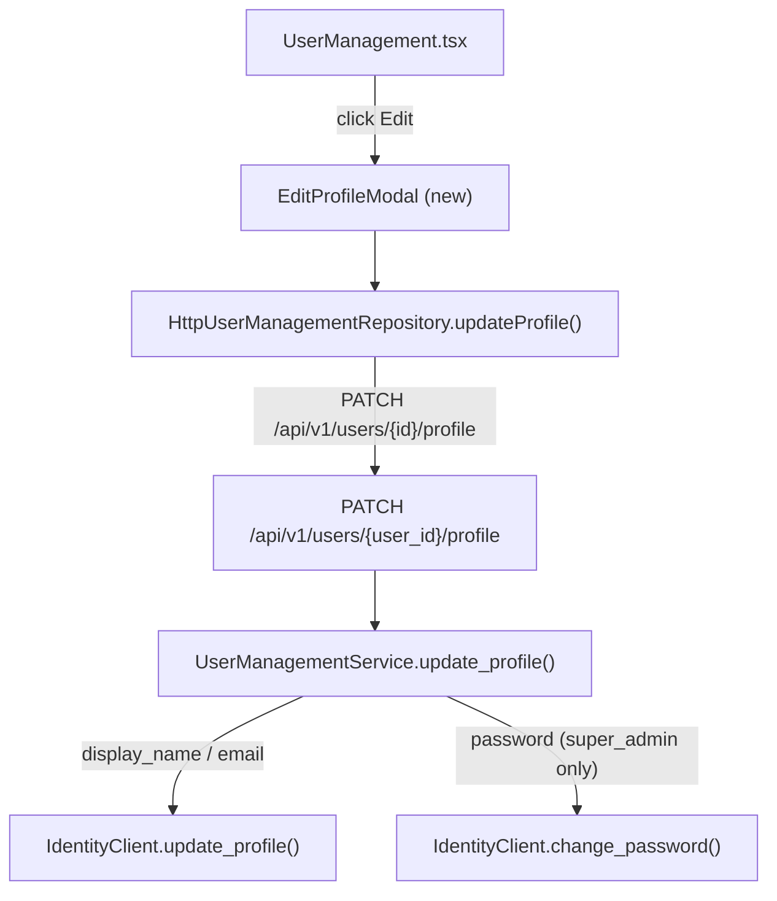
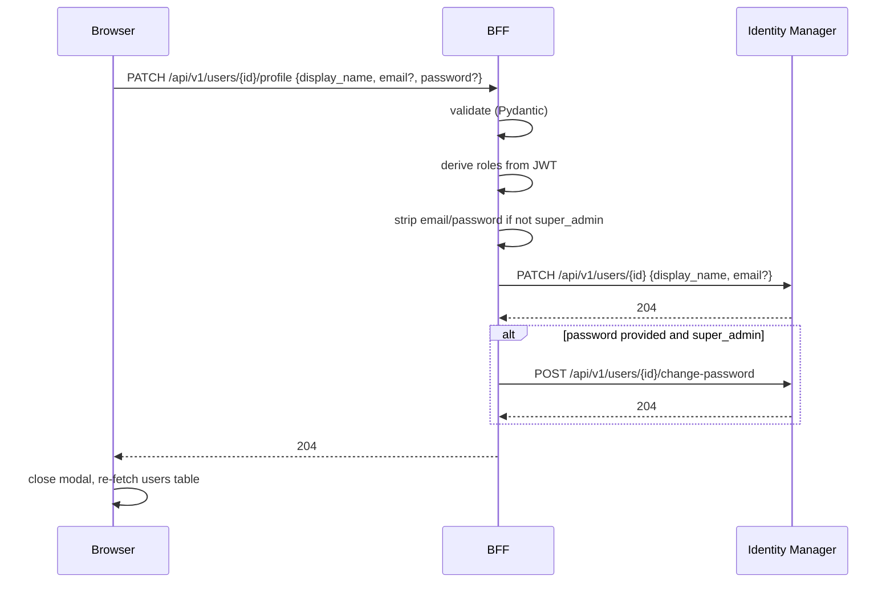

# Design Document

## Overview

This feature adds an "Edit" button to each row in the Users table that opens an
`EditProfileModal`. The modal lets `admin` users edit `display_name` only, and
`super_admin` users edit `display_name`, `email`, and `password`. Role enforcement
is applied server-side in the BFF regardless of what the client sends.

The change spans three layers:

- **Frontend (admin-shell)**: new `EditProfileModal` component, `UserManagementRepository`
  port extension, `HttpUserManagementRepository` implementation, `UserManagement.tsx` wiring.
- **BFF (Python/FastAPI)**: new `PATCH /api/v1/users/{user_id}/profile` endpoint in
  `users.py`, `UserManagementService.update_profile` method, `IdentityClient` port
  extension, `IdentityManagerClient` concrete implementation.

No new npm or Python packages are required.

---

## Architecture

### Component Interaction Diagram



### Role-Based Field Access

| Field | `admin` | `super_admin` |
|-------|---------|---------------|
| `display_name` | ✅ editable | ✅ editable |
| `email` | 🔒 read-only | ✅ editable |
| `password` | ❌ hidden | ✅ editable |

Role enforcement is applied at two levels:
1. **Frontend**: field visibility/editability derived from `RbacProvider` context.
2. **BFF**: `UserManagementService` strips `email` and `password` from the payload when
   `super_admin` is absent from the requesting user's JWT claims — silent discard, not an error.

### Layer Mapping

| Concern | Layer | File |
|---------|-------|------|
| Edit button + modal trigger | presentation | `UserManagement.tsx` |
| Modal UI | presentation | `EditProfileModal.tsx` |
| Port interface | domain | `UserManagementRepository.ts` |
| HTTP adapter | infrastructure | `HttpUserManagementRepository.ts` |
| BFF router | presentation | `src/presentation/api/v1/users.py` |
| BFF application service | application | `src/application/services/user_management_service.py` |
| Identity port extension | domain | `src/domain/repositories/identity_client.py` |
| Identity adapter extension | infrastructure | `src/infrastructure/adapters/identity_manager_client.py` |

---

## Frontend Design

### 1. `EditProfileModal.tsx` — New Component

Follows the same structural pattern as `RoleChangeModal`. Fields rendered depend on
the requesting user's role from `RbacProvider`.

```tsx
// admin-shell/src/presentation/components/modals/EditProfileModal.tsx
import { useState } from "react";
import type { AdminUser } from "../../../domain/entities/AdminUser";
import { useRbac } from "../../../presentation/providers/RbacProvider";
import { updateProfile } from "../../../stores/userManagementStore";

interface Props {
  targetUser: AdminUser;
  onClose: () => void;
  onSuccess: () => void;
}

export function EditProfileModal({ targetUser, onClose, onSuccess }: Props) {
  const { hasRole } = useRbac();
  const isSuperAdmin = hasRole("super_admin");

  const [displayName, setDisplayName] = useState(targetUser.displayName);
  const [email, setEmail] = useState(targetUser.email);
  const [password, setPassword] = useState("");
  const [errors, setErrors] = useState<Record<string, string>>({});
  const [banner, setBanner] = useState<string | null>(null);
  const [saving, setSaving] = useState(false);

  function validate(): boolean {
    const e: Record<string, string> = {};
    if (!displayName.trim()) e.displayName = "Display name is required.";
    if (isSuperAdmin && email && !/^[^\s@]+@[^\s@]+\.[^\s@]+$/.test(email))
      e.email = "Enter a valid email address.";
    if (isSuperAdmin && password && password.length < 8)
      e.password = "Password must be at least 8 characters.";
    setErrors(e);
    return Object.keys(e).length === 0;
  }

  async function handleSave() {
    if (!validate()) return;
    setSaving(true);
    setBanner(null);
    try {
      const fields: { displayName?: string; email?: string; password?: string } = {};
      if (displayName.trim() !== targetUser.displayName) fields.displayName = displayName.trim();
      if (isSuperAdmin && email !== targetUser.email) fields.email = email;
      if (isSuperAdmin && password) fields.password = password;
      await updateProfile(targetUser.id, fields);
      onSuccess();
      onClose();
    } catch (err) {
      setBanner(err instanceof Error ? err.message : "An unexpected error occurred.");
    } finally {
      setSaving(false);
    }
  }

  return (
    <div role="dialog" aria-modal="true" aria-labelledby="edit-profile-title"
      style={{ position: "fixed", inset: 0, background: "rgba(0,0,0,0.4)",
               display: "flex", alignItems: "center", justifyContent: "center", zIndex: 1000 }}>
      <div style={{ background: "#fff", borderRadius: "10px", padding: "28px",
                    width: "420px", maxWidth: "90vw", boxShadow: "0 20px 60px rgba(0,0,0,0.2)" }}>
        <h3 id="edit-profile-title" style={{ margin: "0 0 20px", fontSize: "16px", fontWeight: 700 }}>
          Edit Profile — {targetUser.displayName}
        </h3>

        {/* error banner */}
        {/* display_name field — always shown */}
        {/* email field — read-only for admin, editable for super_admin */}
        {/* password field — hidden for admin, shown for super_admin */}
        {/* Cancel / Save buttons */}
      </div>
    </div>
  );
}
```

### 2. `UserManagementRepository.ts` — Port Extension

```ts
// admin-shell/src/domain/repositories/UserManagementRepository.ts (addition)
export interface ProfileUpdateFields {
  displayName?: string;
  email?: string;
  password?: string;
}

export interface UserManagementRepository {
  // ... existing methods ...
  updateProfile(userId: string, fields: ProfileUpdateFields): Promise<void>;
}
```

### 3. `HttpUserManagementRepository.ts` — Implementation

```ts
async updateProfile(userId: string, fields: ProfileUpdateFields): Promise<void> {
  const body: Record<string, string> = {};
  if (fields.displayName !== undefined) body.display_name = fields.displayName;
  if (fields.email !== undefined) body.email = fields.email;
  if (fields.password !== undefined) body.password = fields.password;
  await this.http.request(`/api/v1/users/${userId}/profile`, {
    method: "PATCH",
    body: JSON.stringify(body),
  });
}
```

### 4. `UserManagement.tsx` — Edit Button and Modal Wiring

An "Edit" button is added to the Actions column of each user row, gated by
`hasRole("admin") || hasRole("super_admin")`. Clicking it sets `editingUser` state
and renders `EditProfileModal`. On success, `fetchUsers` is called to refresh the table.

---

## BFF Design

### 5. `PATCH /api/v1/users/{user_id}/profile` — New Endpoint

```python
class ProfileUpdateRequest(BaseModel):
    display_name: str | None = None
    email: EmailStr | None = None
    password: str | None = None

    @field_validator("display_name")
    @classmethod
    def validate_display_name(cls, v: str | None) -> str | None:
        if v is None:
            return v
        trimmed = v.strip()
        if len(trimmed) == 0:
            raise ValueError("display_name must not be blank")
        if len(trimmed) > 100:
            raise ValueError("display_name must be 100 characters or fewer")
        return html.escape(trimmed)

    @field_validator("password")
    @classmethod
    def validate_password(cls, v: str | None) -> str | None:
        if v is not None and len(v) < 8:
            raise ValueError("password must be at least 8 characters")
        return v


@router.patch("/{user_id}/profile", status_code=204)
async def update_user_profile(
    user_id: str,
    body: ProfileUpdateRequest,
    request: Request,
    user_management_service: UserManagementService = Depends(_get_user_management_service),
) -> Response:
    requesting_roles: list[str] = request.state.user_roles  # from JWT middleware
    await user_management_service.update_profile(
        user_id=user_id,
        display_name=body.display_name,
        email=str(body.email) if body.email else None,
        password=body.password,
        requesting_user_roles=requesting_roles,
        token=request.cookies.get(_ACCESS_TOKEN_COOKIE, ""),
    )
    return Response(status_code=204)
```

### 6. `UserManagementService.update_profile` — New Method

```python
async def update_profile(
    self,
    *,
    user_id: str,
    display_name: str | None,
    email: str | None,
    password: str | None,
    requesting_user_roles: list[str],
    token: str,
) -> None:
    is_super_admin = "super_admin" in requesting_user_roles

    # Server-side role enforcement — silent discard
    if not is_super_admin:
        email = None
        password = None

    fields_updated: list[str] = []
    start = time.perf_counter()
    logger.info("update_profile.started", user_id=user_id,
                fields=[k for k, v in {"display_name": display_name, "email": email,
                                        "password": password} if v is not None])

    profile_fields: dict[str, str] = {}
    if display_name is not None:
        profile_fields["display_name"] = display_name
    if email is not None:
        profile_fields["email"] = email

    if profile_fields:
        await self._identity.update_profile(user_id, profile_fields, token=token)
        fields_updated.extend(profile_fields.keys())

    if password is not None:
        # password value NEVER logged
        await self._identity.change_password(user_id, password, token=token)
        fields_updated.append("password")

    logger.info("update_profile.completed", user_id=user_id,
                fields_updated=fields_updated,
                duration_ms=round((time.perf_counter() - start) * 1000, 2))
```

### 7. `IdentityClient` — Port Extension

Two new abstract async methods added to the existing ABC:

```python
@abstractmethod
async def update_profile(
    self,
    user_id: str,
    fields: dict[str, str],
    *,
    token: str,
) -> None:
    """Update a user's profile fields (display_name, email).
    Distinct from update_own_profile (self-service).
    """

@abstractmethod
async def change_password(
    self,
    user_id: str,
    new_password: str,
    *,
    token: str,
) -> None:
    """Change a user's password (admin-on-other-user).
    new_password MUST NEVER appear in any log entry.
    """
```

### 8. `IdentityManagerClient` — Concrete Implementation

```python
async def update_profile(
    self, user_id: str, fields: dict[str, str], *, token: str
) -> None:
    await self._cb.call(
        self._patch,
        f"/api/v1/users/{user_id}",
        json=fields,
        token=token,
    )

async def change_password(
    self, user_id: str, new_password: str, *, token: str
) -> None:
    # new_password is passed directly to the HTTP body — never logged
    await self._cb.call(
        self._post,
        f"/api/v1/users/{user_id}/change-password",
        json={"new_password": new_password},
        token=token,
    )
```

---

## Data Flow

### Admin-on-User Profile Update (happy path)



### Error Paths

| Scenario | BFF response | Frontend behaviour |
|----------|--------------|--------------------|
| Blank display_name | 422 | Field error on `display_name` |
| Invalid email format | 422 | Field error on `email` |
| Password < 8 chars | 422 | Field error on `password` |
| Requesting user lacks admin/super_admin | 403 | Error banner in modal |
| Identity Manager 4xx/5xx | 502 safe message | Dismissible error banner in modal |
| JWT absent/invalid | 401 | Middleware intercepts before route handler |

---

## Correctness Properties

**P1 — Role enforcement**: For any `PATCH /api/v1/users/{user_id}/profile` request where
the JWT does not contain `super_admin`, the `email` and `password` fields SHALL be absent
from all calls to `IdentityClient`, regardless of what the client sent.

**P2 — Password never logged**: For any call to `UserManagementService.update_profile`
with a non-None `password`, no log record emitted during that call SHALL contain the
password value as a substring of any field.

**P3 — Diff-only submission**: For any `EditProfileModal` save where `displayName` has
not changed from the pre-populated value, the HTTP request body SHALL NOT contain a
`display_name` key.

**P4 — Role-gated field visibility**: For any `EditProfileModal` rendered with a
requesting user whose roles do not include `super_admin`, the `password` input SHALL
NOT be present in the DOM.

**P5 — Validation gate**: For any `display_name` value with `len(trimmed) == 0` or
`len(trimmed) > 100`, the BFF SHALL return HTTP 422 and SHALL NOT call
`IdentityClient.update_profile`.

---

## File Changeset

### New files

| File | Purpose |
|------|---------|
| `admin-shell/src/presentation/components/modals/EditProfileModal.tsx` | Edit profile modal |
| `tests/unit/application/test_user_management_update_profile.py` | BFF service unit tests |
| `tests/unit/presentation/test_users_profile_patch.py` | BFF endpoint tests |
| `admin-shell/src/presentation/components/modals/EditProfileModal.test.tsx` | Frontend unit tests |

### Modified files

| File | Change |
|------|--------|
| `admin-shell/src/presentation/components/pages/UserManagement.tsx` | Add Edit button + EditProfileModal wiring |
| `admin-shell/src/domain/repositories/UserManagementRepository.ts` | Add `updateProfile` method + `ProfileUpdateFields` type |
| `admin-shell/src/infrastructure/repositories/HttpUserManagementRepository.ts` | Implement `updateProfile` |
| `src/presentation/api/v1/users.py` | Add `PATCH /{user_id}/profile` endpoint |
| `src/application/services/user_management_service.py` | Add `update_profile` method |
| `src/domain/repositories/identity_client.py` | Add `update_profile` + `change_password` abstract methods |
| `src/infrastructure/adapters/identity_manager_client.py` | Implement both new methods |
| `tests/unit/infrastructure/test_identity_manager_client.py` | Tests for new methods |
