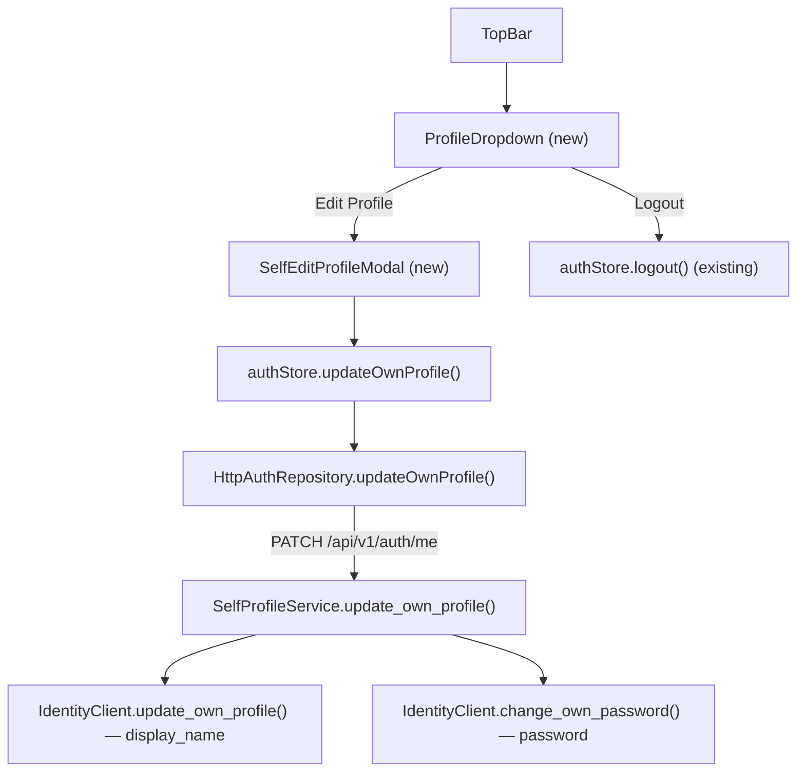
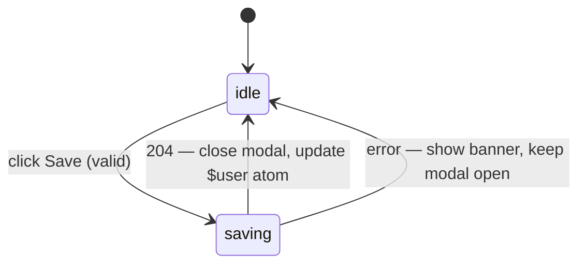
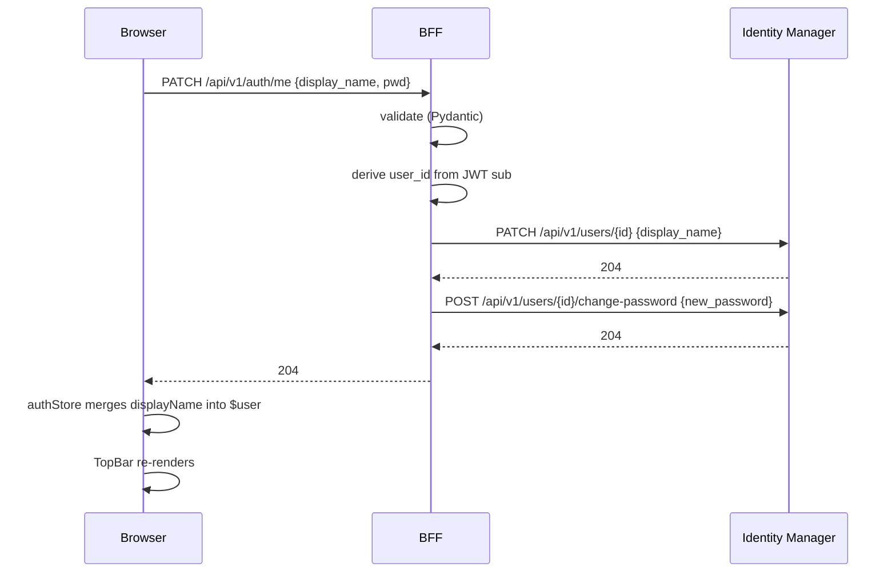

# Design Document

## Overview

This feature replaces the static logout button in `TopBar.tsx` with a clickable profile
dropdown, and adds a self-service profile edit modal. The change spans three layers:

- **Frontend (admin-shell)**: `TopBar`, new `ProfileDropdown` component, new
  `SelfEditProfileModal` component, `AuthRepository` port extension,
  `HttpAuthRepository` implementation, `authStore` action.
- **BFF (Python/FastAPI)**: new `PATCH /api/v1/auth/me` endpoint in `auth.py`,
  new `SelfProfileService` application service, `IdentityClient` port extension,
  `IdentityManagerClient` concrete implementation.

No new npm or Python packages are required — all patterns reuse existing
infrastructure (nanostores, React Router, httpx, Pydantic v2, structlog, CircuitBreaker).

---

## Architecture

### Component Interaction Diagram



### Layer Mapping

| Concern | Layer | File |
|---------|-------|------|
| Dropdown + modal UI | presentation | `TopBar.tsx`, `ProfileDropdown.tsx`, `SelfEditProfileModal.tsx` |
| Auth store action | store | `authStore.ts` |
| Port interface | domain | `AuthRepository.ts` |
| HTTP adapter | infrastructure | `HttpAuthRepository.ts` |
| BFF router | presentation | `src/presentation/api/v1/auth.py` |
| BFF application service | application | `src/application/services/self_profile_service.py` |
| Identity port extension | domain | `src/domain/repositories/identity_client.py` |
| Identity adapter extension | infrastructure | `src/infrastructure/adapters/identity_manager_client.py` |

---

## Frontend Design

### 1. `TopBar.tsx` — Refactored

The existing `TopBar` receives `user` and `onLogout` props. After this change it
also manages the dropdown open/close state and renders `ProfileDropdown` and
`SelfEditProfileModal`.

```tsx
// admin-shell/src/presentation/components/layout/TopBar.tsx
import { useRef, useState } from "react";
import type { AdminUser } from "../../../domain/entities/AdminUser";
import { ProfileDropdown } from "./ProfileDropdown";
import { SelfEditProfileModal } from "../modals/SelfEditProfileModal";

interface TopBarProps {
  user: AdminUser;
  onLogout: () => void;
}

export function TopBar({ user, onLogout }: TopBarProps) {
  const [dropdownOpen, setDropdownOpen] = useState(false);
  const [editModalOpen, setEditModalOpen] = useState(false);
  const triggerRef = useRef<HTMLButtonElement>(null);

  const initials = (user.displayName || user.email || "?")
    .split(" ")
    .map((p) => p[0])
    .join("")
    .toUpperCase()
    .slice(0, 2);

  return (
    <header className="flex items-center justify-end gap-3 px-6 h-14 border-b border-white/10 bg-primary text-white shrink-0">
      {/* Section title slot — populated by admin-back-navigation feature */}

      {/* Profile trigger */}
      <button
        ref={triggerRef}
        role="button"
        aria-haspopup="true"
        aria-expanded={dropdownOpen}
        onClick={() => setDropdownOpen((o) => !o)}
        className="flex items-center gap-2 cursor-pointer bg-transparent border-none text-white hover:opacity-80 transition-opacity"
      >
        <span className="text-sm text-gray-300">{user.displayName}</span>
        {user.avatar ? (
          
        ) : (
          <span className="inline-flex items-center justify-center w-8 h-8 rounded-full bg-brand text-primary text-[13px] font-semibold select-none">
            {initials}
          </span>
        )}
      </button>

      {dropdownOpen && (
        <ProfileDropdown
          triggerRef={triggerRef}
          onClose={() => setDropdownOpen(false)}
          onEditProfile={() => { setDropdownOpen(false); setEditModalOpen(true); }}
          onLogout={onLogout}
        />
      )}

      {editModalOpen && (
        <SelfEditProfileModal
          user={user}
          onClose={() => setEditModalOpen(false)}
        />
      )}
    </header>
  );
}
```

### 2. `ProfileDropdown.tsx` — New Component

Handles click-outside and Escape key dismissal. Uses ARIA `role="menu"` /
`role="menuitem"` pattern. Keyboard navigation: Down Arrow focuses first item on
open; Up/Down cycle between items.

```tsx
// admin-shell/src/presentation/components/layout/ProfileDropdown.tsx
import { useEffect, useRef } from "react";

interface ProfileDropdownProps {
  triggerRef: React.RefObject<HTMLButtonElement | null>;
  onClose: () => void;
  onEditProfile: () => void;
  onLogout: () => void;
}

export function ProfileDropdown({
  triggerRef, onClose, onEditProfile, onLogout,
}: ProfileDropdownProps) {
  const menuRef = useRef<HTMLDivElement>(null);

  // Click-outside
  useEffect(() => {
    function handler(e: MouseEvent) {
      if (
        menuRef.current && !menuRef.current.contains(e.target as Node) &&
        triggerRef.current && !triggerRef.current.contains(e.target as Node)
      ) {
        onClose();
      }
    }
    document.addEventListener("mousedown", handler);
    return () => document.removeEventListener("mousedown", handler);
  }, [onClose, triggerRef]);

  // Escape key
  useEffect(() => {
    function handler(e: KeyboardEvent) {
      if (e.key === "Escape") { onClose(); triggerRef.current?.focus(); }
    }
    document.addEventListener("keydown", handler);
    return () => document.removeEventListener("keydown", handler);
  }, [onClose, triggerRef]);

  // Arrow key navigation
  function handleKeyDown(e: React.KeyboardEvent) {
    const items = menuRef.current?.querySelectorAll<HTMLElement>('[role="menuitem"]');
    if (!items) return;
    const idx = Array.from(items).indexOf(document.activeElement as HTMLElement);
    if (e.key === "ArrowDown") { e.preventDefault(); items[(idx + 1) % items.length]?.focus(); }
    if (e.key === "ArrowUp")   { e.preventDefault(); items[(idx - 1 + items.length) % items.length]?.focus(); }
  }

  return (
    <div
      ref={menuRef}
      role="menu"
      onKeyDown={handleKeyDown}
      className="absolute right-4 top-14 z-50 w-44 bg-white rounded-lg shadow-lg border border-gray-100 py-1"
    >
      <button role="menuitem" onClick={onEditProfile}
        className="w-full text-left px-4 py-2 text-sm text-gray-700 hover:bg-gray-50">
        Edit Profile
      </button>
      <button role="menuitem" onClick={onLogout}
        className="w-full text-left px-4 py-2 text-sm text-gray-700 hover:bg-gray-50">
        Logout
      </button>
    </div>
  );
}
```

### 3. `SelfEditProfileModal.tsx` — New Component

Follows the same structural pattern as `RoleChangeModal` in `UserManagement.tsx`.
Reads current `displayName` from the `user` prop. Validates before submit.
Calls `authStore.updateOwnProfile()` on save.

Fields:
- `display_name` — text, pre-populated, required, max 100 chars
- `new_password` — password, empty, optional (blank = no change)
- `confirm_password` — password, empty, must match `new_password` if non-empty

State machine:


```tsx
// admin-shell/src/presentation/components/modals/SelfEditProfileModal.tsx
import { useState } from "react";
import type { AdminUser } from "../../../domain/entities/AdminUser";
import { updateOwnProfile } from "../../../stores/authStore";

interface Props { user: AdminUser; onClose: () => void; }

export function SelfEditProfileModal({ user, onClose }: Props) {
  const [displayName, setDisplayName] = useState(user.displayName);
  const [newPassword, setNewPassword] = useState("");
  const [confirmPassword, setConfirmPassword] = useState("");
  const [errors, setErrors] = useState<Record<string, string>>({});
  const [banner, setBanner] = useState<string | null>(null);
  const [saving, setSaving] = useState(false);

  function validate(): boolean {
    const e: Record<string, string> = {};
    if (!displayName.trim()) e.displayName = "Display name is required.";
    else if (displayName.trim().length > 100) e.displayName = "Display name must be 100 characters or fewer.";
    if (newPassword && newPassword.length < 8) e.newPassword = "Password must be at least 8 characters.";
    if (newPassword && newPassword !== confirmPassword) e.confirmPassword = "Passwords do not match.";
    setErrors(e);
    return Object.keys(e).length === 0;
  }

  async function handleSave() {
    if (!validate()) return;
    setSaving(true);
    setBanner(null);
    try {
      const fields: { displayName?: string; password?: string } = {};
      if (displayName.trim() !== user.displayName) fields.displayName = displayName.trim();
      if (newPassword) fields.password = newPassword;
      await updateOwnProfile(fields);
      onClose();
    } catch (err) {
      setBanner(err instanceof Error ? err.message : "An unexpected error occurred.");
    } finally {
      setSaving(false);
    }
  }

  return (
    <div role="dialog" aria-modal="true" aria-labelledby="self-edit-title"
      style={{ position: "fixed", inset: 0, background: "rgba(0,0,0,0.4)",
               display: "flex", alignItems: "center", justifyContent: "center", zIndex: 1000 }}>
      <div style={{ background: "#fff", borderRadius: "10px", padding: "28px",
                    width: "400px", maxWidth: "90vw", boxShadow: "0 20px 60px rgba(0,0,0,0.2)" }}>
        <h3 id="self-edit-title" style={{ margin: "0 0 20px", fontSize: "16px", fontWeight: 700 }}>
          Edit Profile
        </h3>

        {banner && (
          <div role="alert" style={{ marginBottom: "16px", padding: "10px 14px",
                                     background: "#fef2f2", border: "1px solid #fca5a5",
                                     borderRadius: "6px", fontSize: "13px", color: "#b91c1c" }}>
            {banner}
            <button onClick={() => setBanner(null)} style={{ float: "right", background: "none",
              border: "none", cursor: "pointer", color: "#b91c1c" }}>✕</button>
          </div>
        )}

        {/* display_name field */}
        {/* new_password field */}
        {/* confirm_password field */}
        {/* Cancel / Save buttons — disabled while saving */}
      </div>
    </div>
  );
}
```

### 4. `AuthRepository.ts` — Port Extension

```ts
// admin-shell/src/domain/repositories/AuthRepository.ts
export interface SelfProfileUpdateFields {
  displayName?: string;
  password?: string;
}

export interface AuthRepository {
  login(email: string, password: string): Promise<AdminUser>;
  logout(): Promise<void>;
  refresh(): Promise<void>;
  getCurrentUser(): Promise<AdminUser>;
  updateOwnProfile(fields: SelfProfileUpdateFields): Promise<void>;  // NEW
}
```

### 5. `HttpAuthRepository.ts` — Implementation

```ts
async updateOwnProfile(fields: SelfProfileUpdateFields): Promise<void> {
  const body: Record<string, string> = {};
  if (fields.displayName !== undefined) body.display_name = fields.displayName;
  if (fields.password !== undefined) body.password = fields.password;
  await this.http.request("/api/v1/auth/me", {
    method: "PATCH",
    body: JSON.stringify(body),
  });
}
```

### 6. `authStore.ts` — New Action

```ts
export async function updateOwnProfile(fields: SelfProfileUpdateFields): Promise<void> {
  $isLoading.set(true);
  $error.set(null);
  try {
    await getRepo().updateOwnProfile(fields);
    // Merge updated displayName into $user atom
    if (fields.displayName !== undefined) {
      const current = $user.get();
      if (current) $user.set({ ...current, displayName: fields.displayName });
    }
    logger.info("Profile updated", {});
  } catch (err) {
    const message = err instanceof Error ? err.message : "Profile update failed";
    $error.set(message);
    throw err; // re-throw so modal can show the banner
  } finally {
    $isLoading.set(false);
  }
}
```

---

## BFF Design

### 7. `PATCH /api/v1/auth/me` — New Endpoint in `auth.py`

```python
class SelfProfileUpdateRequest(BaseModel):
    display_name: str | None = None
    password: str | None = None

    @field_validator("display_name")
    @classmethod
    def validate_display_name(cls, v: str | None) -> str | None:
        if v is None:
            return v
        trimmed = v.strip()
        if len(trimmed) == 0:
            raise ValueError("display_name must not be blank")
        if len(trimmed) > 100:
            raise ValueError("display_name must be 100 characters or fewer")
        return html.escape(trimmed)

    @field_validator("password")
    @classmethod
    def validate_password(cls, v: str | None) -> str | None:
        if v is not None and len(v) < 8:
            raise ValueError("password must be at least 8 characters")
        return v


@router.patch("/me", status_code=204)
async def update_own_profile(
    body: SelfProfileUpdateRequest,
    request: Request,
    self_profile_service: SelfProfileService = Depends(_get_self_profile_service),
) -> Response:
    """Self-service profile update. user_id derived from JWT sub — never from client."""
    token = request.cookies.get(_ACCESS_TOKEN_COOKIE, "")
    # jwt_validation middleware already validated the token; claims are in request.state
    user_id: str = request.state.user_id
    await self_profile_service.update_own_profile(
        user_id=user_id,
        display_name=body.display_name,
        password=body.password,
        token=token,
    )
    return Response(status_code=204)
```

### 8. `SelfProfileService` — New Application Service

```python
# src/application/services/self_profile_service.py
class SelfProfileService:
    def __init__(self, identity_client: IdentityClient) -> None:
        self._identity = identity_client

    async def update_own_profile(
        self,
        *,
        user_id: str,
        display_name: str | None,
        password: str | None,
        token: str,
    ) -> None:
        fields_updated: list[str] = []
        start = time.perf_counter()
        logger.info("update_own_profile.started", user_id=user_id,
                    fields=([k for k in ["display_name", "password"]
                              if (display_name if k == "display_name" else password) is not None]))

        if display_name is not None:
            fields: dict[str, str] = {"display_name": display_name}
            await self._identity.update_own_profile(user_id, fields, token=token)
            fields_updated.append("display_name")

        if password is not None:
            # password value NEVER logged
            await self._identity.change_own_password(user_id, password, token=token)
            fields_updated.append("password")

        logger.info("update_own_profile.completed", user_id=user_id,
                    fields_updated=fields_updated,
                    duration_ms=round((time.perf_counter() - start) * 1000, 2))
```

### 9. `IdentityClient` — Port Extension

Two new abstract async methods added to the existing ABC:

```python
@abstractmethod
async def update_own_profile(
    self,
    user_id: str,
    fields: dict[str, str],
    *,
    token: str,
) -> None:
    """Update the authenticated user's own profile fields (display_name only).
    Distinct from update_profile (admin-on-other-user).
    """

@abstractmethod
async def change_own_password(
    self,
    user_id: str,
    new_password: str,
    *,
    token: str,
) -> None:
    """Change the authenticated user's own password.
    new_password MUST NEVER appear in any log entry.
    """
```

### 10. `IdentityManagerClient` — Concrete Implementation

```python
async def update_own_profile(
    self, user_id: str, fields: dict[str, str], *, token: str
) -> None:
    await self._cb.call(
        self._patch,
        f"/api/v1/users/{user_id}",
        json=fields,
        token=token,
    )

async def change_own_password(
    self, user_id: str, new_password: str, *, token: str
) -> None:
    # new_password is passed directly to the HTTP body — never logged
    await self._cb.call(
        self._post,
        f"/api/v1/users/{user_id}/change-password",
        json={"new_password": new_password},
        token=token,
    )
```

---

## Data Flow

### Self-Profile Update (happy path)



### Error Paths

| Scenario | BFF response | Frontend behaviour |
|----------|--------------|--------------------|
| Blank display_name | 422 `{detail: [...]}` | Field error on `display_name` |
| Password < 8 chars | 422 `{detail: [...]}` | Field error on `new_password` |
| Identity Manager 4xx/5xx | 502 safe message | Dismissible error banner in modal |
| JWT absent/invalid | 401 | `jwt_validation` middleware intercepts before route handler |

---

## Correctness Properties

The following properties must hold and will be validated by property-based tests:

**P1 — Identity isolation**: For any valid `PATCH /api/v1/auth/me` request, the
`user_id` forwarded to the Identity Manager MUST equal the `sub` claim of the
request's JWT. It MUST NOT equal any value from the request body or query string.

**P2 — Password never logged**: For any call to `SelfProfileService.update_own_profile`
with a non-None `password`, no log record emitted during that call SHALL contain
the password value as a substring of any field.

**P3 — Field-only diff submission**: For any `SelfEditProfileModal` save where
`displayName` has not changed from the pre-populated value, the HTTP request body
sent to `PATCH /api/v1/auth/me` SHALL NOT contain a `display_name` key.

**P4 — Atom consistency**: After `authStore.updateOwnProfile({ displayName: X })`
resolves successfully, `$user.get().displayName` SHALL equal `X`.

**P5 — Validation gate**: For any `display_name` value with `len(trimmed) == 0`
or `len(trimmed) > 100`, the BFF SHALL return HTTP 422 and SHALL NOT call
`IdentityClient.update_own_profile`.

**P6 — Password confirmation gate**: For any `SelfEditProfileModal` submission
where `newPassword !== confirmPassword`, the component SHALL NOT call
`authStore.updateOwnProfile`.

---

## File Changeset

### New files

| File | Purpose |
|------|---------|
| `admin-shell/src/presentation/components/layout/ProfileDropdown.tsx` | Dropdown menu |
| `admin-shell/src/presentation/components/modals/SelfEditProfileModal.tsx` | Self-edit modal |
| `src/application/services/self_profile_service.py` | BFF application service |
| `tests/unit/application/test_self_profile_service.py` | Unit tests |
| `tests/unit/presentation/test_auth_me_patch.py` | BFF endpoint tests |
| `admin-shell/src/presentation/components/layout/ProfileDropdown.test.tsx` | Frontend unit tests |
| `admin-shell/src/presentation/components/modals/SelfEditProfileModal.test.tsx` | Frontend unit tests |

### Modified files

| File | Change |
|------|--------|
| `admin-shell/src/presentation/components/layout/TopBar.tsx` | Replace logout button with dropdown trigger |
| `admin-shell/src/domain/repositories/AuthRepository.ts` | Add `updateOwnProfile` method + `SelfProfileUpdateFields` type |
| `admin-shell/src/infrastructure/repositories/HttpAuthRepository.ts` | Implement `updateOwnProfile` |
| `admin-shell/src/stores/authStore.ts` | Add `updateOwnProfile` action |
| `src/presentation/api/v1/auth.py` | Add `PATCH /me` endpoint |
| `src/domain/repositories/identity_client.py` | Add `update_own_profile` + `change_own_password` abstract methods |
| `src/infrastructure/adapters/identity_manager_client.py` | Implement both new methods |
| `tests/unit/infrastructure/test_identity_manager_client.py` | Tests for new methods |
